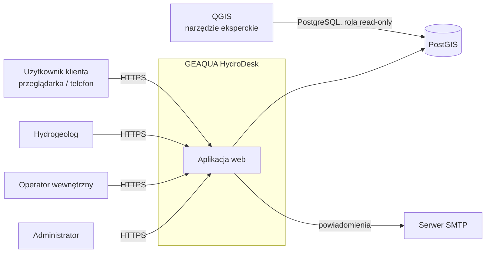
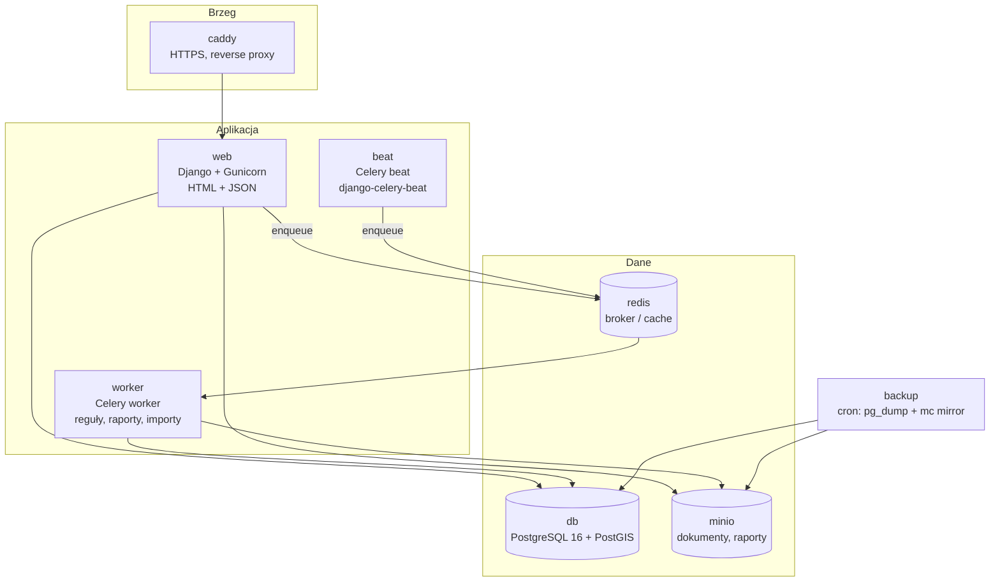
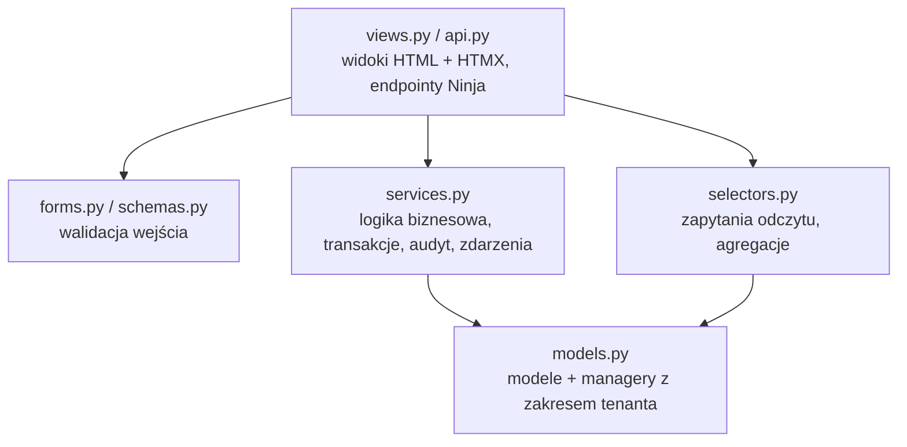
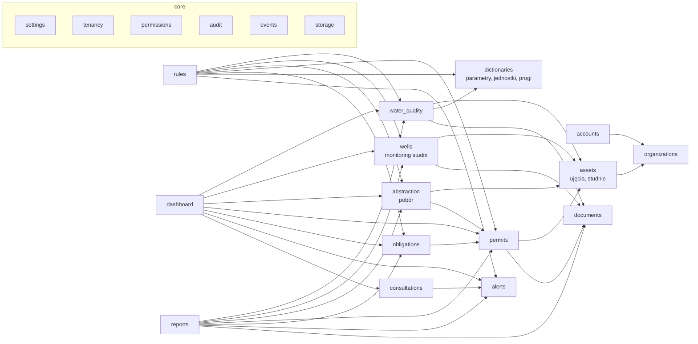
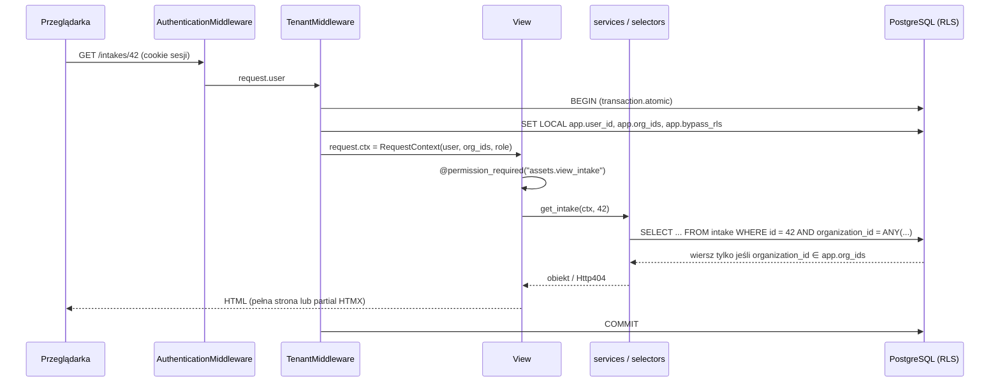
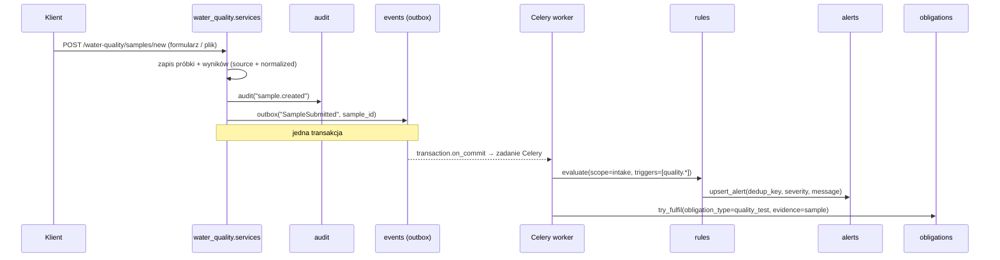

# 02 — Architektura systemu

## 1. Zasady

1. **Modularny monolit** — jeden projekt Django, jeden deployment, moduły domenowe jako osobne aplikacje Django z wyraźnymi granicami (spec sek. 18).
2. **PostgreSQL/PostGIS jako jedyne źródło prawdy** — Redis tylko jako broker/cache, nigdy jako miejsce przechowywania danych biznesowych.
3. **Server-side rendering** — Django Templates + HTMX, bez osobnego SPA. Endpointy JSON (wykresy, przyszłe API) przez Django Ninja.
4. **Bezpieczeństwo w warstwie danych** — izolacja klientów wymuszana przez RLS w Postgresie, nie tylko w kodzie.
5. **Nic nie ginie** — dokumenty i zatwierdzone dane są wersjonowane, usunięcia są miękkie, każda istotna operacja trafia do audytu.
6. **Automat obserwuje, człowiek interpretuje** — reguły opisują zjawisko („trend wzrostowy, 86% progu”), nigdy przyczynę.
7. **Korzystamy z tego, co daje Django** — auth, sesje, CSRF, formularze, admin, i18n, migracje, GeoDjango. Własny kod tylko tam, gdzie wymaga tego domena.

## 2. Stack technologiczny

| Warstwa | Technologia | Uwagi |
|---------|-------------|-------|
| Język | Python 3.12 | |
| Framework | Django 5.2 LTS | wsparcie do 04.2028 |
| GIS | GeoDjango (`django.contrib.gis`) | `PointField(srid=2180)`, GDAL/GEOS w obrazie |
| Postgres-specyficzne | `django.contrib.postgres` | `DateRangeField`, `ArrayField`, indeksy GIN |
| Baza | PostgreSQL 16 + PostGIS 3.4 | |
| Migracje | migracje Django | RLS i polityki przez `RunSQL` / własne operacje migracji |
| Szablony | Django Templates + `django-htmx` + `django-template-partials` | partiale HTMX w tym samym pliku szablonu |
| Formularze | Django Forms + `django-widget-tweaks` | walidacja po stronie serwera |
| Interaktywność | HTMX + Alpine.js (minimalnie) | |
| CSS | Pico.css (PoC) lub Tailwind (standalone CLI) | mobile-first |
| API JSON | Django Ninja | Pydantic, OpenAPI; wykresy, przyszłe publiczne API |
| Auth | `django.contrib.auth` (własny model `User`, logowanie e-mailem), Argon2, `django-axes` | reset hasła i sesje wbudowane |
| Panel admina | Django Admin | słowniki, progi, klienci, użytkownicy, dane robocze |
| Historia zmian | `django-simple-history` + własny `AuditLog` | before/after dla modeli + zdarzenia biznesowe |
| Zadania w tle | Celery + Redis, `django-celery-beat` | harmonogram edytowalny w adminie |
| Pliki | `django-storages[s3]` → MinIO / S3 | prywatny bucket |
| Import danych | pandas + openpyxl + odfpy | |
| Wykresy UI | Chart.js | dane z endpointów Ninja |
| Wykresy PDF | matplotlib | PNG osadzony w raporcie |
| PDF | WeasyPrint | szablon Django → PDF |
| E-mail | Django e-mail (SMTP), Mailpit lokalnie | |
| Serwer aplikacji | Gunicorn | |
| Statyczne | WhiteNoise | bez CDN |
| Reverse proxy | Caddy | HTTPS, nagłówki bezpieczeństwa |
| Testy | pytest-django, factory-boy, Playwright E2E | |
| Jakość | ruff, mypy + django-stubs, import-linter, pre-commit | |
| Zależności | uv | |

## 3. Widok kontekstowy

## 4. Widok kontenerów (Docker Compose)

| Kontener | Obraz | Rola |
|----------|-------|------|
| `caddy` | `caddy:2` | TLS, przekierowanie HTTP→HTTPS, nagłówki |
| `web` | własny (`Dockerfile`, z GDAL/GEOS) | Django, UI + API |
| `worker` | ten sam obraz, inny `command` | zadania Celery |
| `beat` | ten sam obraz | harmonogram (codzienna ewaluacja reguł, raporty miesięczne) |
| `db` | `postgis/postgis:16-3.4` | dane |
| `redis` | `redis:7` | broker Celery, cache, `django-axes` |
| `minio` | `minio/minio` | dokumenty (S3) |
| `mailpit` | `axllent/mailpit` | tylko dev — podgląd e-maili |
| `backup` | `postgres:16` + `mc` | tylko prod — backup cykliczny |

## 5. Warstwy wewnątrz aplikacji Django

Każdy moduł domenowy (aplikacja Django) ma tę samą strukturę, zależności idą tylko w dół:

Zasady (wzorzec „services + selectors”):

- **widok** nie zawiera logiki — walidacja formularza, wywołanie serwisu, wybór odpowiedzi (pełna strona / partial HTMX / JSON),
- **services** to jedyne miejsce zapisu: transakcja, audyt, zdarzenia domenowe,
- **selectors** to zapytania odczytu (dashboardy, serie do wykresów),
- modele są „chude”: pola, ograniczenia, proste właściwości — bez logiki przepływów,
- aplikacje komunikują się przez **publiczne funkcje `services`/`selectors`** lub **zdarzenia domenowe** — nie importują cudzych modeli w widokach (pilnuje `import-linter`; klucze obce między aplikacjami są dozwolone),
- reguły alertów czytają dane przez selektory modułów.

## 6. Moduły (aplikacje Django)

Szczegóły modułów: [04-moduly.md](04-moduly.md).

## 7. Kluczowe przepływy

### 7.1. Żądanie HTTP z izolacją klienta

`TenantMiddleware` zastępuje `ATOMIC_REQUESTS`: sam otwiera `transaction.atomic()` i jako pierwszą instrukcję wykonuje `SET LOCAL`, dzięki czemu kontekst RLS obowiązuje dla całego żądania i znika po jego zakończeniu (bezpieczne przy trwałych połączeniach `CONN_MAX_AGE`).

### 7.2. Dodanie analizy wody → alert

Zdarzenia domenowe zapisywane są w tabeli `outbox` w tej samej transakcji co dane (transactional outbox). Po commicie `transaction.on_commit` wysyła zadanie do Celery; okresowe zadanie `outbox.dispatch` dosyła zdarzenia, które nie trafiły do brokera (np. przy awarii Redis).

### 7.3. Zadania cykliczne (django-celery-beat)

| Zadanie | Harmonogram | Co robi |
|---------|-------------|---------|
| `rules.evaluate_all` | codziennie 03:00 | reguły czasowe: terminy obowiązków, ważność pozwoleń, brak pomiaru, prognoza poboru |
| `alerts.send_digest` | codziennie 07:00 | e-mail z nowymi alertami (klient, hydrogeolog) |
| `reports.generate_monthly` | 1. dzień miesiąca 04:00 | raport automatyczny za poprzedni miesiąc |
| `outbox.dispatch` | co 1 min | dosłanie niewysłanych zdarzeń |
| `maintenance.clearsessions` | codziennie | `manage.py clearsessions` |

Harmonogramy przechowywane w bazie i edytowalne przez admina w Django Admin.

## 8. Warstwa prezentacji

- **Layout** mobile-first, jedna kolumna na telefonie; dashboard jako kafle.
- **HTMX** do: formularzy (walidacja inline), filtrów list, odświeżania kafli, modali potwierdzenia.
- Ten sam widok obsługuje pełną stronę i partial: `if request.htmx: return render(request, "wq/samples.html#table", ctx)` (`django-htmx` + `django-template-partials`).
- **Formularze**: Django Forms, minimalna liczba pól, słowniki jako `ModelChoiceField`, wartości domyślne (dzisiejsza data, ostatnia studnia, jednostka z parametru).
- **Statusy**: zawsze ikona + tekst + kolor (nie tylko kolor — spec sek. 12).
- **Teksty** UI i komunikaty alertów po polsku, przez gettext Django (``, `locale/pl`) — gotowość na inne języki.
- **Wykresy**: Chart.js, endpoint Ninja `GET /api/.../series` zwraca serię + linie wartości odniesienia.
- Funkcje zaawansowane (konfiguracja reguł, zatwierdzanie) widoczne tylko dla ról wewnętrznych; panel `/admin` tylko dla personelu.

## 9. Rozszerzalność (sek. 20 wymagań)

| Przyszła funkcja | Punkt rozszerzenia |
|------------------|-------------------|
| Telemetria / SCADA | tabele pomiarów mają `source` (`manual`, `import`, `telemetry`); TimescaleDB jako rozszerzenie Postgresa w razie wolumenu |
| Integracja z laboratoriami | moduł `documents.extractors` — interfejs `Extractor`, kolejne implementacje |
| OCR / AI | `Extractor` dla PDF/obrazów (np. Claude API — vision), wynik zawsze jako `draft` do weryfikacji |
| Publiczne API | Django Ninja już jest; dodanie tokenów API + wersjonowanie `/api/v1` |
| Aplikacja mobilna | to samo API Ninja |
| SMS | `notifications` z interfejsem kanału (e-mail → SMS) |
| Zaawansowane modele | osobny worker z ciężkimi zależnościami, ten sam broker |

## 10. Wymagania niefunkcjonalne (cele PoC)

| Obszar | Cel |
|--------|-----|
| Wydajność | dashboard < 500 ms p95 przy 50 klientach, 500 studniach |
| Dostępność | pojedyncza instancja, RTO 4 h, RPO 24 h (backup dzienny) |
| Skalowanie | pionowe; `web` i `worker` bezstanowe → możliwe skalowanie poziome |
| Obserwowalność | logi JSON (structlog), Sentry (opcjonalnie), `/healthz`, `/readyz` |
| Dostępność UI | WCAG 2.1 AA dla dashboardu klienta (kontrast, etykiety, nie tylko kolor) |
