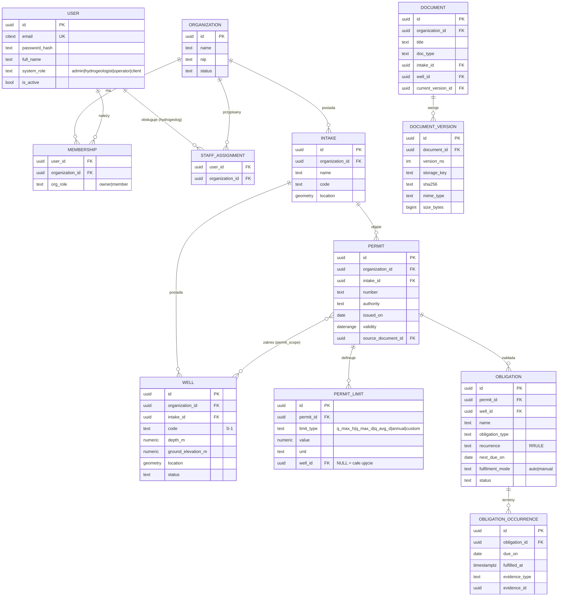
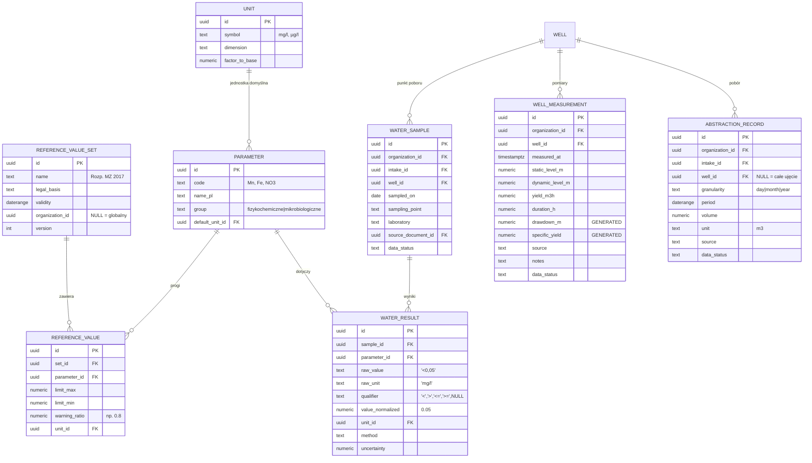
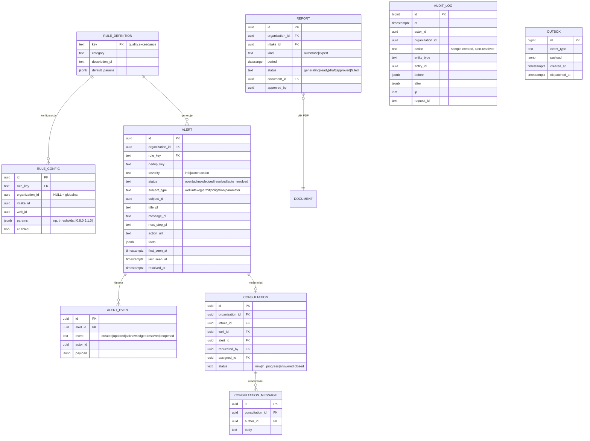

# 03 — Model danych

PostgreSQL 16 + PostGIS. Schemat `public` dla danych aplikacji, `gis` dla widoków dla QGIS, `audit` dla rejestru operacji.

## 1. Konwencje

| Element | Konwencja |
|---------|-----------|
| Klucz główny | `UUIDField(primary_key=True)`, UUIDv7 generowane w aplikacji (sortowalne) |
| Tenant | `organization_id UUID NOT NULL` w **każdej** tabeli danych klienta |
| Znaczniki | `created_at`, `created_by`, `updated_at`, `updated_by` |
| Usuwanie | miękkie: `deleted_at`, `deleted_by`; brak `DELETE` dla ról aplikacyjnych na tabelach danych |
| Status danych | `data_status`: `draft` / `submitted` / `approved` / `rejected` |
| Źródło | `source`: `manual` / `import` / `ocr` / `telemetry` + `source_document_id` |
| Nazwy | snake_case, liczba pojedyncza (`well`, `permit`) |
| Geometria | GeoDjango `PointField(srid=2180)` (PUWG 1992), widoki w `gis` udostępniają też 4326 |
| Wartości liczbowe | `NUMERIC` (nie `float`) dla wyników analiz i limitów |
| Czas | `timestamptz` dla zdarzeń, `date` dla dat pomiaru/okresów, `daterange`/`tstzrange` dla okresów ważności |

## 2. ERD — rdzeń



## 3. ERD — dane pomiarowe



### 3.1. Wartość źródłowa vs znormalizowana (FR-WQ-03)

`<0,05 mg/l` zapisujemy jako:

| kolumna | wartość |
|---------|---------|
| `raw_value` | `<0,05` |
| `raw_unit` | `mg/l` |
| `qualifier` | `<` |
| `value_normalized` | `0.05` |
| `unit_id` | `mg/l` (jednostka bazowa parametru) |

Reguły progów biorą pod uwagę `qualifier`: wynik `<0,05` przy progu `0,05` **nie** jest przekroczeniem; `>0,5` przy progu `0,5` **jest** przekroczeniem. Wykres rysuje takie punkty innym markerem.

### 3.2. Wielkości wyliczane (studnie)

Kolumny generowane (`GENERATED ALWAYS AS ... STORED`, w Django `models.GeneratedField(db_persist=True)`):

- `drawdown_m = dynamic_level_m - static_level_m` (gdy oba niepuste; zwierciadło mierzone jako głębokość od terenu),
- `specific_yield = yield_m3h / drawdown_m` (gdy `drawdown_m > 0`), jednostka m³/h/m.

### 3.3. Wersjonowanie progów (FR-WQ-06)

- `reference_value_set` ma `validity` (zakres dat), `legal_basis` (źródło) i `version`.
- Wynik oceniany jest wg zestawu obowiązującego w dniu `sampled_on`.
- Klient może mieć zestaw indywidualny (`organization_id` niepusty) — ma pierwszeństwo przed globalnym.
- Zestawów zatwierdzonych nie edytujemy — tworzymy nową wersję.

## 4. ERD — alerty, konsultacje, raporty, audyt



### 4.1. Deduplikacja alertów (sek. 11)

```sql
CREATE UNIQUE INDEX alert_active_dedup
    ON alert (organization_id, dedup_key)
    WHERE status IN ('open', 'acknowledged');
```

`dedup_key` = `rule_key` + identyfikator przedmiotu + wariant, np.
`abstraction.limit_usage:intake=<id>:limit=annual:level=90`.
Ewaluacja robi `INSERT ... ON CONFLICT DO UPDATE SET last_seen_at, facts, severity`.

## 5. Wieloklientowość (izolacja danych)

Szczegóły i uzasadnienie: [ADR-0003](adr/0003-wieloklientowosc-rls.md).

1. Każda tabela danych klienta ma `organization_id NOT NULL` + indeks.
2. Tabele potomne (np. `water_result`) też mają `organization_id` (denormalizacja) — prostsze i szybsze polityki RLS.
3. Spójność: klucze obce złożone `(organization_id, intake_id) REFERENCES intake (organization_id, id)` — nie da się podpiąć studni pod ujęcie innego klienta. Django nie obsługuje złożonych FK w ORM, więc: zwykły `ForeignKey` + `UniqueConstraint(organization_id, id)` na rodzicu + dodatkowy constraint złożony przez własną operację migracji (`core.migrations_ops.CompositeForeignKey`).
4. RLS włączone i wymuszone (`FORCE ROW LEVEL SECURITY`) na każdej tabeli danych:

```sql
ALTER TABLE well ENABLE ROW LEVEL SECURITY;
ALTER TABLE well FORCE ROW LEVEL SECURITY;

CREATE POLICY tenant_isolation ON well
    USING (
        current_setting('app.bypass_rls', true) = 'on'
        OR organization_id = ANY (string_to_array(current_setting('app.org_ids', true), ',')::uuid[])
    )
    WITH CHECK (
        current_setting('app.bypass_rls', true) = 'on'
        OR organization_id = ANY (string_to_array(current_setting('app.org_ids', true), ',')::uuid[])
    );
```

5. `app.org_ids` ustawiane per transakcja (`SET LOCAL`, w `TenantMiddleware` / `TenantTask`) z kontekstu użytkownika:
   - użytkownik klienta → jego organizacje z `membership`,
   - hydrogeolog / operator → organizacje z `staff_assignment`,
   - admin → `app.bypass_rls = on` (tylko dla operacji administracyjnych, logowane w audycie),
   - zadania Celery → jawnie podany zakres organizacji zadania.
6. Brak ustawionego kontekstu ⇒ brak wierszy (bezpieczny domyślny stan).

## 6. Role bazodanowe

| Rola | Uprawnienia |
|------|-------------|
| `hydrodesk_owner` | właściciel schematu, `manage.py migrate` — nie używana przez aplikację w runtime |
| `hydrodesk_app` | `SELECT/INSERT/UPDATE` na tabelach danych, **bez** `DELETE` na danych pomiarowych, podlega RLS (tabele systemowe Django — sesje, auth, celery-beat — bez RLS) |
| `hydrodesk_gis_ro` | `SELECT` tylko na widokach `gis.*` (QGIS), widoki z `security_barrier` |
| `hydrodesk_backup` | `pg_dump` |

## 7. Widoki dla QGIS

```sql
CREATE VIEW gis.wells WITH (security_barrier) AS
SELECT w.id, o.name AS client, i.name AS intake, w.code, w.status,
       w.location AS geom_2180,
       ST_Transform(w.location, 4326) AS geom_4326,
       lm.measured_at AS last_measurement_at, lm.static_level_m, lm.yield_m3h
FROM well w
JOIN intake i ON i.id = w.intake_id
JOIN organization o ON o.id = w.organization_id
LEFT JOIN LATERAL (
    SELECT * FROM well_measurement m
    WHERE m.well_id = w.id AND m.deleted_at IS NULL
    ORDER BY measured_at DESC LIMIT 1
) lm ON true
WHERE w.deleted_at IS NULL;
```

## 8. Historia zmian danych

- **Dokumenty**: każdy upload = nowy `document_version`; `document.current_version_id` wskazuje aktualną; pliki niezmienne w S3.
- **Dane zatwierdzone** (`data_status = approved`): edycja tworzy rekord historii (`django-simple-history`) i wpis w `audit_log`; użytkownik klienta nie może edytować zatwierdzonych — może zgłosić korektę.
- **Usuwanie**: tylko miękkie, z potwierdzeniem w UI i wpisem audytowym; przywracanie przez hydrogeologa/admina.
