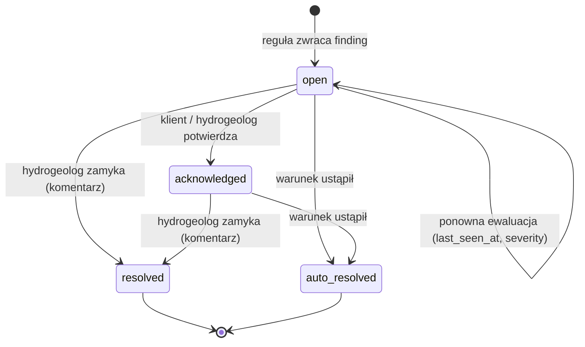

# 05 — Silnik reguł i alerty

## 1. Zasady

- Alert jest **zawsze** wynikiem konkretnej reguły (`rule_key`) i konkretnych faktów (`facts` JSON).
- Reguła opisuje **obserwowane zjawisko**, nie przyczynę.
- Jeden aktywny alert na zdarzenie (`dedup_key`) — kolejne ewaluacje aktualizują go, nie dublują.
- Każdy alert ma: tytuł, komunikat, **następny krok** i **link do akcji** (sek. 17 pkt 4, 12).
- Gdy warunek przestaje być spełniony — alert zamyka się automatycznie (`auto_resolved`), z wpisem w historii.

## 2. Budowa reguły

Reguły są kodem Pythona (testowalne, wersjonowane w git); parametry (progi, okna czasowe) są w bazie (`rule_config`) — konfigurowalne globalnie, per klient, per ujęcie/studnia.

```python
@register_rule("abstraction.limit_usage", category="abstraction")
class LimitUsageRule(Rule):
    default_params = {"levels": [0.8, 0.9, 1.0]}
    triggers = {"AbstractionRecorded", "PermitChanged", "daily"}

    def evaluate(self, ctx: RuleContext, subject: Intake) -> list[Finding]:
        findings = []
        for usage in abstraction_selectors.limit_usage(ctx, subject):
            level = highest_crossed(usage.ratio, ctx.params["levels"])
            if level is None:
                continue
            findings.append(Finding(
                dedup_key=f"{self.key}:intake={subject.id}:limit={usage.limit_type}",
                severity="action" if level >= 1.0 else "watch",
                title=f"Wykorzystano {usage.ratio:.0%} limitu {usage.limit_label}",
                message=f"Pobór od początku okresu: {usage.used} m³, limit: {usage.limit} m³.",
                next_step="Sprawdź harmonogram poboru. W razie wątpliwości skonsultuj się z hydrogeologiem.",
                action_url=f"/intakes/{subject.id}/abstraction",
                facts=usage.as_facts(),
            ))
        return findings
```

Silnik (`rules.engine`):

1. wybiera reguły pasujące do wyzwalacza (zdarzenie lub `daily`),
2. dla każdego przedmiotu w zakresie (ujęcie/studnia/pozwolenie/obowiązek) liczy `findings`,
3. `upsert` alertów po `dedup_key` (z poziomem — przejście z 80% na 90% podnosi severity tego samego alertu),
4. aktywne alerty tej reguły i przedmiotu, dla których nie ma już `finding` → `auto_resolved`,
5. zapis `alert_event` + audyt + zdarzenie `AlertOpened` (powiadomienia).

## 3. Katalog reguł v1

| Klucz | Kategoria | Warunek (domyślnie) | Severity |
|-------|-----------|--------------------|----------|
| `quality.exceedance` | Jakość | wynik > limit (z uwzględnieniem `qualifier`) | action |
| `quality.near_limit` | Jakość | wynik ≥ `warning_ratio` × limit (domyślnie 80%) | watch |
| `quality.adverse_trend` | Jakość | ≥ 4 wyniki, trend rosnący, prognoza 12 mies. ≥ limit lub wzrost > 20% | watch |
| `quality.microbiology` | Jakość | wynik mikrobiologiczny > 0 / > limit | action |
| `well.yield_decline` | Studnia | spadek wydajności jednostkowej > 15% względem mediany bazowej (ostatnie 12 mies.) w ≥ 2 kolejnych pomiarach | watch |
| `well.drawdown_increase` | Studnia | wzrost depresji > 20% przy porównywalnej wydajności | watch |
| `well.level_change` | Studnia | zmiana zwierciadła statycznego > X m względem poprzedniego pomiaru/średniej sezonowej | watch |
| `well.missing_measurement` | Studnia | brak pomiaru dłużej niż wymagana częstotliwość (z obowiązku lub domyślnie 90 dni) | no_data |
| `abstraction.limit_usage` | Pobór | wykorzystanie ≥ 80 / 90 / 100% | watch / watch / action |
| `abstraction.exceeded` | Pobór | pobór > limit (Qmax,h, Qmax,d, Qśr,d, roczny, własne) | action |
| `abstraction.forecast_exceedance` | Pobór | prognoza na koniec okresu > 100% | watch |
| `abstraction.systematic_increase` | Pobór | ≥ 3 kolejne miesiące wzrostu r/r > 10% | info |
| `permit.expiring` | Pozwolenia | do końca ważności ≤ 24/12/6/3/1 mies. | info → action (≤ 6 mies.) |
| `permit.expired` | Pozwolenia | pozwolenie wygasłe, brak nowego | action |
| `obligation.due_soon` | Obowiązki | termin za ≤ 14 dni | info |
| `obligation.due_today` | Obowiązki | termin dziś | watch |
| `obligation.overdue` | Obowiązki | termin minął, brak wykonania | action |
| `obligation.missing_evidence` | Obowiązki | wykonanie bez wymaganego dokumentu/wyniku | watch |

Wartości liczbowe są punktem startowym — do kalibracji z hydrogeologiem w pilotażu.

## 4. Statusy w UI (sek. 12)

| Status | Kod | Ikona | Kolor | Mapowanie |
|--------|-----|-------|-------|-----------|
| OK | `ok` | ✓ | zielony | brak aktywnych alertów |
| Obserwacja | `watch` | 👁 / ◐ | żółty | najwyższy alert `watch` lub `info` |
| Wymaga działania | `action` | ! | czerwony | jakikolwiek alert `action` |
| Brak danych | `no_data` | ? | szary | brak danych do oceny lub alert `no_data` |

Status zawsze wyświetlany jako ikona **i** tekst — kolor tylko wspiera.

## 5. Komunikaty

Szablony komunikatów w plikach tłumaczeń Django (`locale/pl/LC_MESSAGES/django.po`), z parametrami z `facts`. Przykłady:

| Reguła | Tytuł | Następny krok |
|--------|-------|---------------|
| `quality.near_limit` | Mangan: 86% wartości granicznej | Obserwuj kolejne wyniki. Jeśli wartość dalej rośnie, skonsultuj się z hydrogeologiem. |
| `quality.adverse_trend` | Mangan wykazuje trend wzrostowy | Zaplanuj kolejne badanie zgodnie z harmonogramem. [Skonsultuj z hydrogeologiem] |
| `well.missing_measurement` | Brakuje pomiaru zwierciadła S-3 | Dodaj pomiar. [Dodaj pomiar] |
| `abstraction.forecast_exceedance` | Prognozowane przekroczenie limitu rocznego (109%) | Przy obecnym tempie limit zostanie przekroczony ok. 15.11. Rozważ ograniczenie poboru. |
| `permit.expiring` | Pozwolenie wodnoprawne wygasa za 6 miesięcy | Rozpocznij przygotowanie wniosku o nowe pozwolenie. [Skonsultuj z hydrogeologiem] |
| `obligation.overdue` | Po terminie: pomiar zwierciadła S-2 | Wykonaj pomiar i dodaj go do systemu. [Dodaj pomiar] |

Zakazane w komunikatach automatycznych: słownictwo przyczynowe („z powodu”, „przyczyną jest”, „spowodowane przez”) — test jednostkowy przeszukuje szablony.

## 6. Cykl życia alertu



- Zamknięcie ręczne wymaga komentarza i trafia do audytu (sek. 16).
- Po zamknięciu ręcznym ta sama reguła może otworzyć **nowy** alert (nowy wiersz), jeśli warunek wystąpi ponownie — opcjonalny `snooze_until`, by uniknąć natychmiastowego ponownego otwarcia.

## 7. Wyzwalanie

| Wyzwalacz | Kiedy | Zakres |
|-----------|-------|--------|
| zdarzenie domenowe (outbox → Celery) | po zapisie analizy, pomiaru, poboru, zmiany pozwolenia/obowiązku | przedmiot zdarzenia (studnia/ujęcie) |
| `daily` (django-celery-beat 03:00) | codziennie | wszystkie aktywne ujęcia, reguły czasowe |
| ręczny | „Przelicz” w panelu hydrogeologa | wskazane ujęcie |

Zadania Celery są idempotentne (upsert po `dedup_key`), więc ponowne uruchomienie jest bezpieczne.

## 8. Powiadomienia

- `AlertOpened` / zmiana severity na `action` → e-mail natychmiast do hydrogeologa przypisanego,
- klient: dzienne podsumowanie (digest) nowych alertów,
- ustawienia powiadomień per użytkownik (włącz/wyłącz, natychmiast/digest).
