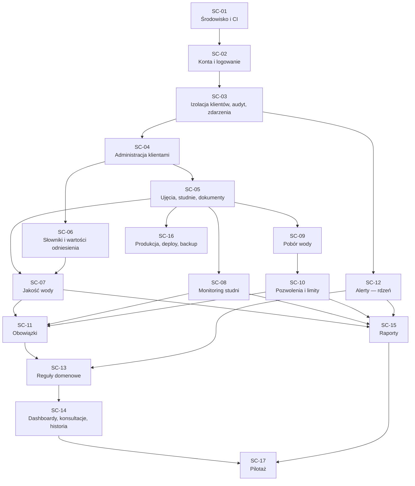
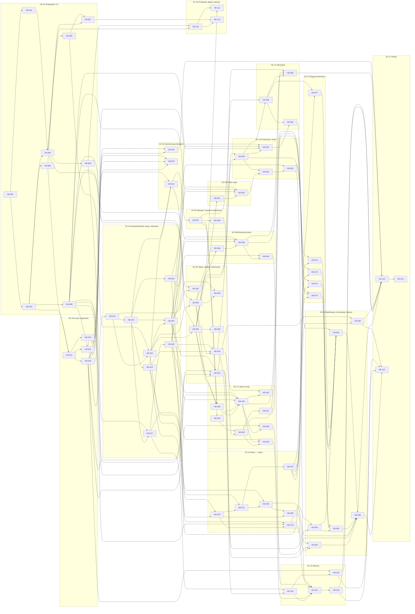

# 08 — Zadania (backlog PoC)

Backlog podzielony na **scope'y** — testowalne przyrosty funkcjonalności — i w ich ramach na **atomowe tickety** dla poszczególnych agentów / deweloperów. Relacje „zależy od” / „blokuje”, zależności między scope'ami i fale są wyliczane z jednej listy zależności, więc są spójne w obie strony.

Powiązane dokumenty: [01-plan-poc.md](01-plan-poc.md) (etapy), [04-moduly.md](04-moduly.md) (moduły i uprawnienia), [05-silnik-regul-i-alerty.md](05-silnik-regul-i-alerty.md) (reguły), [07-struktura-repo.md](07-struktura-repo.md) (struktura i konwencje).

**Podsumowanie:** 17 scope'ów, 80 ticketów, ≈ 140 dni roboczych pracy, ścieżka krytyczna ≈ 34 dni przy pełnym zrównolegleniu.

## 1. Zasady pracy

### Scope

- Scope to zestaw ticketów, który po zmergowaniu **daje się przetestować w całości** — ręcznie (scenariusz) i automatycznie (`pytest -m scXX`).
- Scope zaczynamy, gdy scope'y, od których zależy, są **zamknięte** (wszystkie tickety `done` + test scope'u zaliczony). Tickety z różnych niezależnych scope'ów mogą iść równolegle.
- **Zamknięcie scope'u**: ktoś spoza autorów ticketów przechodzi scenariusz ręczny na `seed_demo`, CI zielone, wynik w PR/Issue, tag `scope/SC-XX` na `poc`.
- Testy automatyczne scope'u oznaczone markerem: w pliku testów `pytestmark = pytest.mark.sc07` (markery rejestrowane w `conftest.py`). Uruchomienie: `uv run pytest -m sc07`.
- Scope dodający dane domenowe rozszerza `seed_demo` (plik `seed_demo.py` w swojej aplikacji), żeby scenariusz ręczny dało się przejść bez ręcznego wprowadzania danych.

### Ticket

1. **Wybór**: ticket, którego wszystkie zależności mają status `done`. Tickety z tej samej fali są od siebie niezależne.
2. **Branch**: `feat/HD-XXX-krotki-opis` od aktualnego `poc`. Jeden ticket = jeden branch = jeden PR do `poc`.
3. **Zakres**: tylko to, co w tickecie. Rzeczy poza zakresem → nowy ticket (sekcja 6).
4. **PR**: tytuł `HD-XXX: <tytuł>`, Conventional Commits, w opisie odhaczone kryteria akceptacji.
5. **Status**: aktualizuj kolumnę Status w tabeli (sekcja 3): `todo` → `in_progress` (draft PR) → `done` (merge).
6. **Migracje**: przed merge rebase na `poc`; konflikt numeracji → `makemigrations --merge` lub przenumerowanie własnej.

### Definition of Done ticketu

- kryteria akceptacji spełnione i wymienione w PR,
- testy unit/integration z markerem scope'u; CI zielone,
- nowa tabela z `organization_id` → `EnableTenantRLS` w migracji (strażnik [HD-016](#hd-016)),
- nowy widok/endpoint z danymi klienta → test izolacji ([HD-022](#hd-022)),
- zapisy przez `services` z audytem; brak logiki w widokach i sygnałach,
- teksty UI po polsku (gettext), statusy z ikoną i tekstem, formularze używalne na 375 px,
- `seed_demo` rozszerzony, jeśli ticket dodaje dane potrzebne w scenariuszu scope'u,
- dokumentacja w `docs/` zaktualizowana, jeśli zmienia się model lub decyzja.

## 2. Scope'y

### Graf scope'ów

| Scope | Nazwa | Tickety | Zależy od | Blokuje | Kryteria odbioru v1 | Testy | Status |
|-------|-------|:-------:|-----------|---------|:-------------------:|-------|--------|
| [SC-01](#sc-01) | Środowisko i CI | 9 | — | [SC-02](#sc-02) | — | `pytest -m sc01` | todo |
| [SC-02](#sc-02) | Konta i logowanie | 4 | [SC-01](#sc-01) | [SC-03](#sc-03) | — | `pytest -m sc02` | todo |
| [SC-03](#sc-03) | Izolacja klientów, audyt, zdarzenia | 8 | [SC-02](#sc-02) | [SC-04](#sc-04), [SC-12](#sc-12) | 3 (fundament), 19 (fundament) | `pytest -m sc03` | todo |
| [SC-04](#sc-04) | Administracja klientami | 3 | [SC-03](#sc-03) | [SC-05](#sc-05), [SC-06](#sc-06) | 1 | `pytest -m sc04` | todo |
| [SC-05](#sc-05) | Ujęcia, studnie, dokumenty | 7 | [SC-04](#sc-04) | [SC-07](#sc-07), [SC-08](#sc-08), [SC-09](#sc-09), [SC-16](#sc-16) | 2, 3 | `pytest -m sc05` | todo |
| [SC-06](#sc-06) | Słowniki i wartości odniesienia | 2 | [SC-04](#sc-04) | [SC-07](#sc-07) | — | `pytest -m sc06` | todo |
| [SC-07](#sc-07) | Jakość wody | 8 | [SC-05](#sc-05), [SC-06](#sc-06) | [SC-11](#sc-11), [SC-15](#sc-15) | 4, 5 | `pytest -m sc07` | todo |
| [SC-08](#sc-08) | Monitoring studni | 3 | [SC-05](#sc-05) | [SC-11](#sc-11), [SC-15](#sc-15) | 7, 8 | `pytest -m sc08` | todo |
| [SC-09](#sc-09) | Pobór wody | 2 | [SC-05](#sc-05) | [SC-10](#sc-10) | 9 | `pytest -m sc09` | todo |
| [SC-10](#sc-10) | Pozwolenia i limity | 4 | [SC-09](#sc-09) | [SC-11](#sc-11), [SC-15](#sc-15) | 10, 11, 12 | `pytest -m sc10` | todo |
| [SC-11](#sc-11) | Obowiązki | 3 | [SC-07](#sc-07), [SC-08](#sc-08), [SC-10](#sc-10) | [SC-13](#sc-13) | 13 | `pytest -m sc11` | todo |
| [SC-12](#sc-12) | Alerty — rdzeń | 6 | [SC-03](#sc-03) | [SC-13](#sc-13), [SC-15](#sc-15) | — | `pytest -m sc12` | todo |
| [SC-13](#sc-13) | Reguły domenowe | 5 | [SC-11](#sc-11), [SC-12](#sc-12) | [SC-14](#sc-14) | 6, 14 | `pytest -m sc13` | todo |
| [SC-14](#sc-14) | Dashboardy, konsultacje, historia | 6 | [SC-13](#sc-13) | [SC-17](#sc-17) | 15, 16, 17, 19 | `pytest -m sc14` | todo |
| [SC-15](#sc-15) | Raporty | 4 | [SC-07](#sc-07), [SC-08](#sc-08), [SC-10](#sc-10), [SC-12](#sc-12) | [SC-17](#sc-17) | 18 | `pytest -m sc15` | todo |
| [SC-16](#sc-16) | Produkcja, deploy, backup | 3 | [SC-05](#sc-05) | — | 20 | `pytest -m sc16` | todo |
| [SC-17](#sc-17) | Pilotaż | 3 | [SC-14](#sc-14), [SC-15](#sc-15) | — | 1–20 | `pytest -m sc17` | todo |

### SC-01

**Środowisko i CI** — Każdy może postawić projekt lokalnie, CI pilnuje jakości.

- **Zależy od:** —
- **Blokuje:** [SC-02](#sc-02)
- **Tickety:** [HD-001](#hd-001), [HD-002](#hd-002), [HD-003](#hd-003), [HD-004](#hd-004), [HD-005](#hd-005), [HD-006](#hd-006), [HD-007](#hd-007), [HD-008](#hd-008), [HD-009](#hd-009)
- **Testy automatyczne:** `uv run pytest -m sc01`
- **Scenariusz testu ręcznego** (na `manage.py seed_demo`):
  - [ ] `docker compose up -d` → wszystkie usługi `healthy`
  - [ ] http://localhost:8000/readyz → 200; po `docker compose stop redis` → 503
  - [ ] strona demo komponentów UI wygląda poprawnie na telefonie (DevTools 375 px)
  - [ ] PR z błędem lintu → CI czerwone

### SC-02

**Konta i logowanie** — Użytkownicy z rolami logują się i resetują hasło.

- **Zależy od:** [SC-01](#sc-01)
- **Blokuje:** [SC-03](#sc-03)
- **Tickety:** [HD-011](#hd-011), [HD-012](#hd-012), [HD-013](#hd-013), [HD-018](#hd-018)
- **Testy automatyczne:** `uv run pytest -m sc02`
- **Scenariusz testu ręcznego** (na `manage.py seed_demo`):
  - [ ] `createsuperuser` → logowanie e-mailem
  - [ ] reset hasła: e-mail w Mailpit, link działa raz
  - [ ] 5 błędnych haseł → blokada konta
  - [ ] użytkownik każdej roli ma właściwą grupę w adminie

### SC-03

**Izolacja klientów, audyt, zdarzenia** — Fundament bezpieczeństwa: RLS, kontekst żądania, audyt, outbox, API.

- **Zależy od:** [SC-02](#sc-02)
- **Blokuje:** [SC-04](#sc-04), [SC-12](#sc-12)
- **Tickety:** [HD-014](#hd-014), [HD-015](#hd-015), [HD-016](#hd-016), [HD-017](#hd-017), [HD-019](#hd-019), [HD-020](#hd-020), [HD-022](#hd-022), [HD-024](#hd-024)
- **Kryteria odbioru v1:** 3 (fundament), 19 (fundament)
- **Testy automatyczne:** `uv run pytest -m sc03`
- **Scenariusz testu ręcznego** (na `manage.py seed_demo`):
  - [ ] `uv run pytest -m sc03` — testy RLS, strażnik migracji, izolacja, outbox
  - [ ] w `psql` rolą `hydrodesk_app` bez `SET app.org_ids` → `SELECT` z tabeli testowej zwraca 0 wierszy
  - [ ] logowanie → wpis `auth.login` w `audit.audit_log` z IP
  - [ ] `/api/docs` dostępne tylko dla personelu

### SC-04

**Administracja klientami** — Admin zakłada klienta i zaprasza jego użytkownika; dane demo dostępne.

- **Zależy od:** [SC-03](#sc-03)
- **Blokuje:** [SC-05](#sc-05), [SC-06](#sc-06)
- **Tickety:** [HD-021](#hd-021), [HD-023](#hd-023), [HD-025](#hd-025)
- **Kryteria odbioru v1:** 1
- **Testy automatyczne:** `uv run pytest -m sc04`
- **Scenariusz testu ręcznego** (na `manage.py seed_demo`):
  - [ ] `manage.py seed_demo` → loguj się kolejno jako admin, hydrogeolog, operator, klient
  - [ ] admin w `/admin` tworzy klienta i zaprasza użytkownika → e-mail w Mailpit → ustawienie hasła → logowanie
  - [ ] użytkownik klienta wchodzi na `/admin` → brak dostępu

### SC-05

**Ujęcia, studnie, dokumenty** — Struktura Klient → Ujęcie → Studnia i bezpieczne dokumenty.

- **Zależy od:** [SC-04](#sc-04)
- **Blokuje:** [SC-07](#sc-07), [SC-08](#sc-08), [SC-09](#sc-09), [SC-16](#sc-16)
- **Tickety:** [HD-030](#hd-030), [HD-031](#hd-031), [HD-032](#hd-032), [HD-033](#hd-033), [HD-034](#hd-034), [HD-035](#hd-035), [HD-036](#hd-036)
- **Kryteria odbioru v1:** 2, 3
- **Testy automatyczne:** `uv run pytest -m sc05`
- **Scenariusz testu ręcznego** (na `manage.py seed_demo`):
  - [ ] personel tworzy ujęcie i 2 studnie (mapa lub współrzędne)
  - [ ] klient A widzi swoje ujęcie; klient B pod tym samym URL dostaje 404
  - [ ] upload PDF z telefonu (DevTools) → nowa wersja tego samego dokumentu → obie wersje do pobrania
  - [ ] plik .exe przemianowany na .pdf → odrzucony
  - [ ] usunięcie dokumentu wymaga potwierdzenia, hydrogeolog przywraca
  - [ ] QGIS: warstwa `gis.wells` ładuje się rolą `hydrodesk_gis_ro`

### SC-06

**Słowniki i wartości odniesienia** — Parametry, jednostki i wersjonowane progi gotowe do użycia.

- **Zależy od:** [SC-04](#sc-04)
- **Blokuje:** [SC-07](#sc-07)
- **Tickety:** [HD-037](#hd-037), [HD-038](#hd-038)
- **Testy automatyczne:** `uv run pytest -m sc06`
- **Scenariusz testu ręcznego** (na `manage.py seed_demo`):
  - [ ] `loaddata dictionaries` → parametry i jednostki w adminie
  - [ ] admin tworzy zestaw progów ważny od 2017 i nowszy od 2026 → selektor zwraca właściwy dla daty
  - [ ] edycja zatwierdzonego zestawu → błąd, możliwe tylko „nowa wersja”

### SC-07

**Jakość wody** — Dodawanie analiz, import, wyniki ze statusami, wykres, zatwierdzanie.

- **Zależy od:** [SC-05](#sc-05), [SC-06](#sc-06)
- **Blokuje:** [SC-11](#sc-11), [SC-15](#sc-15)
- **Tickety:** [HD-040](#hd-040), [HD-041](#hd-041), [HD-042](#hd-042), [HD-043](#hd-043), [HD-044](#hd-044), [HD-045](#hd-045), [HD-046](#hd-046), [HD-047](#hd-047)
- **Kryteria odbioru v1:** 4, 5
- **Testy automatyczne:** `uv run pytest -m sc07`
- **Scenariusz testu ręcznego** (na `manage.py seed_demo`):
  - [ ] klient dodaje analizę ręcznie z wartością `<0,05` → w szczegółach widać `<0,05` i wartość znormalizowaną
  - [ ] import przykładowego XLSX z `tests/fixtures/` → mapowanie → podgląd → zatwierdzenie; oryginał dostępny
  - [ ] wynik powyżej progu oznaczony „Wymaga działania”, 85% progu — „Obserwacja”
  - [ ] wykres parametru z linią progu
  - [ ] hydrogeolog zatwierdza analizę; klient nie może jej już edytować; historia pokazuje zmiany

### SC-08

**Monitoring studni** — Pomiary studni z wyliczaną depresją i wykresami.

- **Zależy od:** [SC-05](#sc-05)
- **Blokuje:** [SC-11](#sc-11), [SC-15](#sc-15)
- **Tickety:** [HD-048](#hd-048), [HD-049](#hd-049), [HD-050](#hd-050)
- **Kryteria odbioru v1:** 7, 8
- **Testy automatyczne:** `uv run pytest -m sc08`
- **Scenariusz testu ręcznego** (na `manage.py seed_demo`):
  - [ ] klient dodaje pomiar z telefonu (375 px) w < 30 s
  - [ ] depresja i wydajność jednostkowa wyliczone automatycznie
  - [ ] historia pomiarów i 5 wykresów na karcie studni

### SC-09

**Pobór wody** — Wprowadzanie poboru dla studni i ujęcia.

- **Zależy od:** [SC-05](#sc-05)
- **Blokuje:** [SC-10](#sc-10)
- **Tickety:** [HD-051](#hd-051), [HD-052](#hd-052)
- **Kryteria odbioru v1:** 9
- **Testy automatyczne:** `uv run pytest -m sc09`
- **Scenariusz testu ręcznego** (na `manage.py seed_demo`):
  - [ ] klient wprowadza pobór miesięczny za 3 miesiące; formularz podpowiada kolejny brakujący okres
  - [ ] ponowny wpis za ten sam miesiąc → komunikat błędu

### SC-10

**Pozwolenia i limity** — Pozwolenie z limitami, porównanie poboru i prognoza.

- **Zależy od:** [SC-09](#sc-09)
- **Blokuje:** [SC-11](#sc-11), [SC-15](#sc-15)
- **Tickety:** [HD-060](#hd-060), [HD-061](#hd-061), [HD-062](#hd-062), [HD-063](#hd-063)
- **Kryteria odbioru v1:** 10, 11, 12
- **Testy automatyczne:** `uv run pytest -m sc10`
- **Scenariusz testu ręcznego** (na `manage.py seed_demo`):
  - [ ] personel wprowadza pozwolenie z limitem rocznym i Qmax,d + dokument źródłowy
  - [ ] zestawienie poboru: % wykorzystania każdego limitu
  - [ ] dane z przykładu w sek. 8 wymagań → prognoza 109%
  - [ ] klient widzi pozwolenie tylko do odczytu

### SC-11

**Obowiązki** — Cykliczne obowiązki z automatycznym zaliczaniem.

- **Zależy od:** [SC-07](#sc-07), [SC-08](#sc-08), [SC-10](#sc-10)
- **Blokuje:** [SC-13](#sc-13)
- **Tickety:** [HD-064](#hd-064), [HD-065](#hd-065), [HD-066](#hd-066)
- **Kryteria odbioru v1:** 13
- **Testy automatyczne:** `uv run pytest -m sc11`
- **Scenariusz testu ręcznego** (na `manage.py seed_demo`):
  - [ ] personel tworzy obowiązek „Pomiar zwierciadła S-2, raz na kwartał”
  - [ ] lista terminów pokazuje „pozostało X dni” i przycisk [Dodaj pomiar]
  - [ ] dodanie pomiaru S-2 → termin wykonany, pojawia się następny
  - [ ] pomiar S-1 nie zamyka obowiązku S-2

### SC-12

**Alerty — rdzeń** — Silnik reguł, cykl życia alertu, UI i powiadomienia (testowane regułą testową).

- **Zależy od:** [SC-03](#sc-03)
- **Blokuje:** [SC-13](#sc-13), [SC-15](#sc-15)
- **Tickety:** [HD-070](#hd-070), [HD-071](#hd-071), [HD-072](#hd-072), [HD-078](#hd-078), [HD-079](#hd-079), [HD-080](#hd-080)
- **Testy automatyczne:** `uv run pytest -m sc12`
- **Scenariusz testu ręcznego** (na `manage.py seed_demo`):
  - [ ] `uv run pytest -m sc12` — reguła testowa tworzy, aktualizuje i auto-zamyka alert; brak duplikatów
  - [ ] admin zmienia parametr reguły per studnia → nadpisuje globalny
  - [ ] klient potwierdza alert, hydrogeolog zamyka z komentarzem; historia alertu widoczna
  - [ ] alert `action` → e-mail do hydrogeologa w Mailpit

### SC-13

**Reguły domenowe** — Wszystkie reguły v1 generują alerty na prawdziwych danych.

- **Zależy od:** [SC-11](#sc-11), [SC-12](#sc-12)
- **Blokuje:** [SC-14](#sc-14)
- **Tickety:** [HD-073](#hd-073), [HD-074](#hd-074), [HD-075](#hd-075), [HD-076](#hd-076), [HD-077](#hd-077)
- **Kryteria odbioru v1:** 6, 14
- **Testy automatyczne:** `uv run pytest -m sc13`
- **Scenariusz testu ręcznego** (na `manage.py seed_demo`):
  - [ ] analiza z przekroczeniem → alert jakości w ciągu kilku sekund
  - [ ] brak pomiaru studni dłużej niż wymagane → alert „Brakuje pomiaru…”
  - [ ] pobór 80% → 90% limitu → ten sam alert z wyższym poziomem
  - [ ] pozwolenie ważne do 31.03.2027 → alert „6 miesięcy”
  - [ ] obowiązek za 12 dni → alert; po dodaniu pomiaru alert znika
  - [ ] żaden komunikat nie zawiera diagnozy przyczyn

### SC-14

**Dashboardy, konsultacje, historia** — Główne ekrany systemu dla klienta i hydrogeologa.

- **Zależy od:** [SC-13](#sc-13)
- **Blokuje:** [SC-17](#sc-17)
- **Tickety:** [HD-090](#hd-090), [HD-091](#hd-091), [HD-092](#hd-092), [HD-093](#hd-093), [HD-094](#hd-094), [HD-095](#hd-095)
- **Kryteria odbioru v1:** 15, 16, 17, 19
- **Testy automatyczne:** `uv run pytest -m sc14`
- **Scenariusz testu ręcznego** (na `manage.py seed_demo`):
  - [ ] klient po zalogowaniu widzi 5 kafli z tekstami jak w sek. 4 wymagań (dane demo)
  - [ ] z alertu klient klika [Skonsultuj z hydrogeologiem], wpisuje tylko wiadomość
  - [ ] hydrogeolog widzi konsultację na swoim dashboardzie i odpowiada
  - [ ] karta studni → zakładka Historia pokazuje kto i co zmienił
  - [ ] wszystko działa na 375 px

### SC-15

**Raporty** — Automatyczny raport PDF i raport ekspercki.

- **Zależy od:** [SC-07](#sc-07), [SC-08](#sc-08), [SC-10](#sc-10), [SC-12](#sc-12)
- **Blokuje:** [SC-17](#sc-17)
- **Tickety:** [HD-100](#hd-100), [HD-101](#hd-101), [HD-102](#hd-102), [HD-103](#hd-103)
- **Kryteria odbioru v1:** 18
- **Testy automatyczne:** `uv run pytest -m sc15`
- **Scenariusz testu ręcznego** (na `manage.py seed_demo`):
  - [ ] „Generuj teraz” → PDF pojawia się na liście bez przeładowania
  - [ ] PDF zawiera wszystkie sekcje z sek. 15.1 i maks. kilka wykresów, bez diagnoz
  - [ ] hydrogeolog tworzy raport ekspercki; klient widzi go dopiero po zatwierdzeniu

### SC-16

**Produkcja, deploy, backup** — System gotowy do postawienia na serwerze i odtworzenia po awarii.

- **Zależy od:** [SC-05](#sc-05)
- **Blokuje:** —
- **Tickety:** [HD-110](#hd-110), [HD-111](#hd-111), [HD-112](#hd-112)
- **Kryteria odbioru v1:** 20
- **Testy automatyczne:** `uv run pytest -m sc16`
- **Scenariusz testu ręcznego** (na `manage.py seed_demo`):
  - [ ] staging po HTTPS z ważnym certyfikatem, merge do `poc` aktualizuje go automatycznie
  - [ ] `ops/backup.sh` → `ops/restore.sh` na czystym serwerze → dane i dokument dostępne
  - [ ] rollback do poprzedniego obrazu wg instrukcji

### SC-17

**Pilotaż** — Pełny odbiór v1.

- **Zależy od:** [SC-14](#sc-14), [SC-15](#sc-15)
- **Blokuje:** —
- **Tickety:** [HD-113](#hd-113), [HD-114](#hd-114), [HD-115](#hd-115)
- **Kryteria odbioru v1:** 1–20
- **Testy automatyczne:** `uv run pytest -m sc17`
- **Scenariusz testu ręcznego** (na `manage.py seed_demo`):
  - [ ] scenariusz `docs/demo.md` przechodzi dla kryteriów 1–20 na świeżej bazie
  - [ ] testy E2E zielone w CI
  - [ ] raport z przeglądu bezpieczeństwa bez otwartych krytycznych znalezisk

## 3. Przegląd ticketów

Rozmiar: **S** ≈ do 1 dnia, **M** ≈ 1–2 dni, **L** ≈ 3–4 dni. Fala = najwcześniejszy możliwy start (wszystkie zależności z fal wcześniejszych).

| ID | Tytuł | Scope | Rozm. | Fala | Zależy od | Blokuje | Status |
|----|-------|-------|:-----:|:----:|-----------|---------|--------|
| [HD-001](#hd-001) | Inicjalizacja projektu Python | [SC-01](#sc-01) | S | 1 | — | [HD-002](#hd-002), [HD-003](#hd-003) | todo |
| [HD-002](#hd-002) | Projekt Django i konfiguracja środowisk | [SC-01](#sc-01) | S | 2 | [HD-001](#hd-001) | [HD-004](#hd-004), [HD-006](#hd-006), [HD-008](#hd-008), [HD-011](#hd-011) | todo |
| [HD-003](#hd-003) | Dockerfile aplikacji | [SC-01](#sc-01) | S | 2 | [HD-001](#hd-001) | [HD-004](#hd-004) | todo |
| [HD-004](#hd-004) | Docker Compose dla dev | [SC-01](#sc-01) | M | 3 | [HD-002](#hd-002), [HD-003](#hd-003) | [HD-005](#hd-005), [HD-009](#hd-009), [HD-033](#hd-033), [HD-110](#hd-110) | todo |
| [HD-005](#hd-005) | Inicjalizacja bazy: role i rozszerzenia | [SC-01](#sc-01) | S | 4 | [HD-004](#hd-004) | [HD-007](#hd-007), [HD-016](#hd-016) | todo |
| [HD-006](#hd-006) | Infrastruktura testów | [SC-01](#sc-01) | S | 3 | [HD-002](#hd-002) | [HD-007](#hd-007), [HD-011](#hd-011) | todo |
| [HD-007](#hd-007) | CI — GitHub Actions | [SC-01](#sc-01) | S | 5 | [HD-006](#hd-006), [HD-005](#hd-005) | [HD-112](#hd-112) | todo |
| [HD-008](#hd-008) | Bazowy layout UI i komponenty | [SC-01](#sc-01) | M | 3 | [HD-002](#hd-002) | [HD-012](#hd-012), [HD-031](#hd-031), [HD-032](#hd-032), [HD-043](#hd-043), [HD-049](#hd-049), [HD-052](#hd-052), [HD-061](#hd-061), [HD-079](#hd-079) | todo |
| [HD-009](#hd-009) | Celery i healthchecki | [SC-01](#sc-01) | S | 4 | [HD-004](#hd-004) | [HD-017](#hd-017), [HD-110](#hd-110) | todo |
| [HD-011](#hd-011) | Własny model User | [SC-02](#sc-02) | S | 4 | [HD-002](#hd-002), [HD-006](#hd-006) | [HD-012](#hd-012), [HD-013](#hd-013), [HD-018](#hd-018) | todo |
| [HD-012](#hd-012) | Logowanie, wylogowanie, reset hasła | [SC-02](#sc-02) | M | 5 | [HD-011](#hd-011), [HD-008](#hd-008) | [HD-023](#hd-023) | todo |
| [HD-013](#hd-013) | Organizacje, członkostwa, przypisania personelu | [SC-02](#sc-02) | S | 5 | [HD-011](#hd-011) | [HD-014](#hd-014), [HD-023](#hd-023), [HD-025](#hd-025) | todo |
| [HD-018](#hd-018) | Role, grupy i uprawnienia | [SC-02](#sc-02) | M | 5 | [HD-011](#hd-011) | [HD-021](#hd-021), [HD-023](#hd-023), [HD-025](#hd-025), [HD-031](#hd-031), [HD-046](#hd-046), [HD-061](#hd-061), [HD-103](#hd-103) | todo |
| [HD-014](#hd-014) | Bazowe modele i managery z zakresem tenanta | [SC-03](#sc-03) | M | 6 | [HD-013](#hd-013) | [HD-015](#hd-015), [HD-016](#hd-016), [HD-032](#hd-032) | todo |
| [HD-015](#hd-015) | RequestContext i TenantMiddleware | [SC-03](#sc-03) | M | 7 | [HD-014](#hd-014) | [HD-017](#hd-017), [HD-019](#hd-019), [HD-021](#hd-021), [HD-022](#hd-022), [HD-024](#hd-024) | todo |
| [HD-016](#hd-016) | Operacje migracji RLS i złożonych FK + strażnik w CI | [SC-03](#sc-03) | M | 7 | [HD-014](#hd-014), [HD-005](#hd-005) | [HD-022](#hd-022), [HD-030](#hd-030), [HD-033](#hd-033), [HD-070](#hd-070) | todo |
| [HD-017](#hd-017) | TenantTask — kontekst RLS w zadaniach Celery | [SC-03](#sc-03) | S | 8 | [HD-015](#hd-015), [HD-009](#hd-009) | [HD-020](#hd-020), [HD-071](#hd-071), [HD-100](#hd-100) | todo |
| [HD-019](#hd-019) | Audyt i historia zmian | [SC-03](#sc-03) | M | 8 | [HD-015](#hd-015) | [HD-021](#hd-021), [HD-034](#hd-034), [HD-070](#hd-070), [HD-095](#hd-095) | todo |
| [HD-020](#hd-020) | Zdarzenia domenowe i outbox | [SC-03](#sc-03) | M | 9 | [HD-017](#hd-017) | [HD-034](#hd-034), [HD-043](#hd-043), [HD-049](#hd-049), [HD-052](#hd-052), [HD-078](#hd-078) | todo |
| [HD-022](#hd-022) | Framework testów izolacji klientów | [SC-03](#sc-03) | S | 8 | [HD-016](#hd-016), [HD-015](#hd-015) | [HD-031](#hd-031), [HD-035](#hd-035), [HD-043](#hd-043), [HD-049](#hd-049), [HD-052](#hd-052), [HD-061](#hd-061), [HD-079](#hd-079) | todo |
| [HD-024](#hd-024) | Django Ninja — API JSON | [SC-03](#sc-03) | S | 8 | [HD-015](#hd-015) | [HD-045](#hd-045), [HD-050](#hd-050), [HD-063](#hd-063) | todo |
| [HD-021](#hd-021) | Django Admin z zakresem tenanta | [SC-04](#sc-04) | M | 9 | [HD-015](#hd-015), [HD-018](#hd-018), [HD-019](#hd-019) | [HD-030](#hd-030), [HD-037](#hd-037) | todo |
| [HD-023](#hd-023) | Zaproszenie użytkownika klienta | [SC-04](#sc-04) | S | 6 | [HD-012](#hd-012), [HD-013](#hd-013), [HD-018](#hd-018) | — | todo |
| [HD-025](#hd-025) | Komenda seed_demo (szkielet) | [SC-04](#sc-04) | S | 6 | [HD-013](#hd-013), [HD-018](#hd-018) | [HD-113](#hd-113) | todo |
| [HD-030](#hd-030) | Modele ujęć i studni | [SC-05](#sc-05) | M | 10 | [HD-016](#hd-016), [HD-021](#hd-021) | [HD-031](#hd-031), [HD-036](#hd-036), [HD-040](#hd-040), [HD-048](#hd-048), [HD-051](#hd-051), [HD-060](#hd-060) | todo |
| [HD-031](#hd-031) | Widoki ujęć i studni | [SC-05](#sc-05) | M | 11 | [HD-030](#hd-030), [HD-008](#hd-008), [HD-018](#hd-018), [HD-022](#hd-022) | [HD-090](#hd-090), [HD-093](#hd-093), [HD-095](#hd-095) | todo |
| [HD-032](#hd-032) | Soft delete w UI: potwierdzenie i przywracanie | [SC-05](#sc-05) | S | 7 | [HD-014](#hd-014), [HD-008](#hd-008) | — | todo |
| [HD-033](#hd-033) | Modele dokumentów i storage | [SC-05](#sc-05) | M | 8 | [HD-016](#hd-016), [HD-004](#hd-004) | [HD-034](#hd-034), [HD-035](#hd-035), [HD-040](#hd-040), [HD-060](#hd-060), [HD-111](#hd-111) | todo |
| [HD-034](#hd-034) | Upload dokumentów | [SC-05](#sc-05) | M | 10 | [HD-033](#hd-033), [HD-019](#hd-019), [HD-020](#hd-020) | [HD-044](#hd-044), [HD-066](#hd-066), [HD-100](#hd-100) | todo |
| [HD-035](#hd-035) | Pobieranie dokumentów | [SC-05](#sc-05) | S | 9 | [HD-033](#hd-033), [HD-022](#hd-022) | — | todo |
| [HD-036](#hd-036) | Widoki GIS dla QGIS | [SC-05](#sc-05) | S | 11 | [HD-030](#hd-030) | — | todo |
| [HD-037](#hd-037) | Słowniki: parametry, jednostki, laboratoria, typy | [SC-06](#sc-06) | M | 10 | [HD-021](#hd-021) | [HD-038](#hd-038), [HD-040](#hd-040), [HD-041](#hd-041), [HD-064](#hd-064) | todo |
| [HD-038](#hd-038) | Wersjonowane wartości odniesienia | [SC-06](#sc-06) | M | 11 | [HD-037](#hd-037) | [HD-042](#hd-042) | todo |
| [HD-040](#hd-040) | Modele analiz jakości wody | [SC-07](#sc-07) | M | 11 | [HD-030](#hd-030), [HD-037](#hd-037), [HD-033](#hd-033) | [HD-043](#hd-043) | todo |
| [HD-041](#hd-041) | Parser wartości i normalizacja jednostek | [SC-07](#sc-07) | S | 11 | [HD-037](#hd-037) | [HD-042](#hd-042), [HD-043](#hd-043) | todo |
| [HD-042](#hd-042) | Ocena wyniku względem progu | [SC-07](#sc-07) | S | 12 | [HD-038](#hd-038), [HD-041](#hd-041) | [HD-045](#hd-045), [HD-047](#hd-047), [HD-073](#hd-073) | todo |
| [HD-043](#hd-043) | Ręczne dodanie analizy wody | [SC-07](#sc-07) | M | 12 | [HD-040](#hd-040), [HD-041](#hd-041), [HD-020](#hd-020), [HD-008](#hd-008), [HD-022](#hd-022) | [HD-044](#hd-044), [HD-045](#hd-045), [HD-046](#hd-046), [HD-066](#hd-066) | todo |
| [HD-044](#hd-044) | Import analiz z CSV/XLSX/ODS | [SC-07](#sc-07) | L | 13 | [HD-043](#hd-043), [HD-034](#hd-034) | — | todo |
| [HD-045](#hd-045) | Wyniki, historia i wykres parametru | [SC-07](#sc-07) | M | 13 | [HD-042](#hd-042), [HD-043](#hd-043), [HD-024](#hd-024) | [HD-101](#hd-101) | todo |
| [HD-046](#hd-046) | Zatwierdzanie analiz i korekty | [SC-07](#sc-07) | M | 13 | [HD-043](#hd-043), [HD-018](#hd-018) | [HD-094](#hd-094) | todo |
| [HD-047](#hd-047) | Obliczanie trendu | [SC-07](#sc-07) | S | 13 | [HD-042](#hd-042) | [HD-073](#hd-073) | todo |
| [HD-048](#hd-048) | Model pomiarów studni | [SC-08](#sc-08) | S | 11 | [HD-030](#hd-030) | [HD-049](#hd-049) | todo |
| [HD-049](#hd-049) | Dodawanie i historia pomiarów studni | [SC-08](#sc-08) | M | 12 | [HD-048](#hd-048), [HD-020](#hd-020), [HD-008](#hd-008), [HD-022](#hd-022) | [HD-050](#hd-050), [HD-066](#hd-066), [HD-074](#hd-074) | todo |
| [HD-050](#hd-050) | Wykresy studni | [SC-08](#sc-08) | S | 13 | [HD-049](#hd-049), [HD-024](#hd-024) | [HD-101](#hd-101) | todo |
| [HD-051](#hd-051) | Model poboru wody | [SC-09](#sc-09) | S | 11 | [HD-030](#hd-030) | [HD-052](#hd-052) | todo |
| [HD-052](#hd-052) | Wprowadzanie poboru | [SC-09](#sc-09) | M | 12 | [HD-051](#hd-051), [HD-020](#hd-020), [HD-008](#hd-008), [HD-022](#hd-022) | [HD-062](#hd-062) | todo |
| [HD-060](#hd-060) | Model pozwoleń wodnoprawnych | [SC-10](#sc-10) | M | 11 | [HD-030](#hd-030), [HD-033](#hd-033) | [HD-061](#hd-061), [HD-062](#hd-062), [HD-064](#hd-064), [HD-076](#hd-076) | todo |
| [HD-061](#hd-061) | Widoki pozwoleń | [SC-10](#sc-10) | M | 12 | [HD-060](#hd-060), [HD-018](#hd-018), [HD-008](#hd-008), [HD-022](#hd-022) | [HD-065](#hd-065) | todo |
| [HD-062](#hd-062) | Porównanie poboru z limitami | [SC-10](#sc-10) | M | 13 | [HD-052](#hd-052), [HD-060](#hd-060) | [HD-063](#hd-063) | todo |
| [HD-063](#hd-063) | Prognoza poboru i zestawienie | [SC-10](#sc-10) | M | 14 | [HD-062](#hd-062), [HD-024](#hd-024) | [HD-075](#hd-075), [HD-101](#hd-101) | todo |
| [HD-064](#hd-064) | Model obowiązków i harmonogramu | [SC-11](#sc-11) | M | 12 | [HD-060](#hd-060), [HD-037](#hd-037) | [HD-065](#hd-065), [HD-066](#hd-066), [HD-077](#hd-077) | todo |
| [HD-065](#hd-065) | Widoki obowiązków | [SC-11](#sc-11) | M | 13 | [HD-064](#hd-064), [HD-061](#hd-061) | [HD-092](#hd-092) | todo |
| [HD-066](#hd-066) | Automatyczne zaliczanie obowiązków | [SC-11](#sc-11) | M | 13 | [HD-064](#hd-064), [HD-049](#hd-049), [HD-043](#hd-043), [HD-034](#hd-034) | [HD-113](#hd-113) | todo |
| [HD-070](#hd-070) | Model alertów i cykl życia | [SC-12](#sc-12) | M | 9 | [HD-016](#hd-016), [HD-019](#hd-019) | [HD-071](#hd-071), [HD-079](#hd-079), [HD-080](#hd-080) | todo |
| [HD-071](#hd-071) | Framework silnika reguł | [SC-12](#sc-12) | L | 10 | [HD-070](#hd-070), [HD-017](#hd-017) | [HD-072](#hd-072), [HD-078](#hd-078) | todo |
| [HD-072](#hd-072) | Komunikaty alertów i strażnik języka | [SC-12](#sc-12) | S | 11 | [HD-071](#hd-071) | [HD-073](#hd-073), [HD-074](#hd-074), [HD-075](#hd-075), [HD-076](#hd-076), [HD-077](#hd-077) | todo |
| [HD-078](#hd-078) | Wyzwalanie reguł | [SC-12](#sc-12) | M | 11 | [HD-071](#hd-071), [HD-020](#hd-020) | [HD-080](#hd-080), [HD-094](#hd-094) | todo |
| [HD-079](#hd-079) | UI alertów | [SC-12](#sc-12) | M | 10 | [HD-070](#hd-070), [HD-008](#hd-008), [HD-022](#hd-022) | [HD-090](#hd-090), [HD-093](#hd-093), [HD-101](#hd-101) | todo |
| [HD-080](#hd-080) | Powiadomienia e-mail | [SC-12](#sc-12) | M | 12 | [HD-070](#hd-070), [HD-078](#hd-078) | [HD-093](#hd-093) | todo |
| [HD-073](#hd-073) | Reguły jakości wody | [SC-13](#sc-13) | M | 14 | [HD-072](#hd-072), [HD-042](#hd-042), [HD-047](#hd-047) | [HD-091](#hd-091) | todo |
| [HD-074](#hd-074) | Reguły studni | [SC-13](#sc-13) | M | 13 | [HD-072](#hd-072), [HD-049](#hd-049) | [HD-091](#hd-091) | todo |
| [HD-075](#hd-075) | Reguły poboru | [SC-13](#sc-13) | M | 15 | [HD-072](#hd-072), [HD-063](#hd-063) | [HD-092](#hd-092) | todo |
| [HD-076](#hd-076) | Reguły pozwoleń | [SC-13](#sc-13) | S | 12 | [HD-072](#hd-072), [HD-060](#hd-060) | [HD-092](#hd-092) | todo |
| [HD-077](#hd-077) | Reguły obowiązków | [SC-13](#sc-13) | S | 13 | [HD-072](#hd-072), [HD-064](#hd-064) | [HD-092](#hd-092) | todo |
| [HD-090](#hd-090) | Dashboard klienta — szkielet i agregacja statusów | [SC-14](#sc-14) | M | 12 | [HD-031](#hd-031), [HD-079](#hd-079) | [HD-091](#hd-091), [HD-092](#hd-092) | todo |
| [HD-091](#hd-091) | Kafle: jakość wody i studnie | [SC-14](#sc-14) | M | 15 | [HD-090](#hd-090), [HD-073](#hd-073), [HD-074](#hd-074) | [HD-094](#hd-094) | todo |
| [HD-092](#hd-092) | Kafle: pobór, pozwolenie, obowiązki | [SC-14](#sc-14) | M | 16 | [HD-090](#hd-090), [HD-075](#hd-075), [HD-076](#hd-076), [HD-077](#hd-077), [HD-065](#hd-065) | [HD-094](#hd-094) | todo |
| [HD-093](#hd-093) | Konsultacje z hydrogeologiem | [SC-14](#sc-14) | M | 13 | [HD-079](#hd-079), [HD-031](#hd-031), [HD-080](#hd-080) | [HD-094](#hd-094) | todo |
| [HD-094](#hd-094) | Dashboard hydrogeologa | [SC-14](#sc-14) | L | 17 | [HD-093](#hd-093), [HD-046](#hd-046), [HD-078](#hd-078), [HD-091](#hd-091), [HD-092](#hd-092) | [HD-113](#hd-113), [HD-115](#hd-115) | todo |
| [HD-095](#hd-095) | Historia zmian na kartach obiektów | [SC-14](#sc-14) | S | 12 | [HD-019](#hd-019), [HD-031](#hd-031) | [HD-113](#hd-113), [HD-115](#hd-115) | todo |
| [HD-100](#hd-100) | Infrastruktura raportów | [SC-15](#sc-15) | M | 11 | [HD-034](#hd-034), [HD-017](#hd-017) | [HD-101](#hd-101), [HD-103](#hd-103) | todo |
| [HD-101](#hd-101) | Szablon raportu automatycznego | [SC-15](#sc-15) | L | 15 | [HD-100](#hd-100), [HD-045](#hd-045), [HD-050](#hd-050), [HD-063](#hd-063), [HD-079](#hd-079) | [HD-102](#hd-102) | todo |
| [HD-102](#hd-102) | Harmonogram i lista raportów | [SC-15](#sc-15) | S | 16 | [HD-101](#hd-101) | [HD-113](#hd-113), [HD-115](#hd-115) | todo |
| [HD-103](#hd-103) | Raport ekspercki | [SC-15](#sc-15) | M | 12 | [HD-100](#hd-100), [HD-018](#hd-018) | [HD-113](#hd-113), [HD-115](#hd-115) | todo |
| [HD-110](#hd-110) | Konfiguracja produkcyjna | [SC-16](#sc-16) | M | 5 | [HD-004](#hd-004), [HD-009](#hd-009) | [HD-111](#hd-111), [HD-112](#hd-112) | todo |
| [HD-111](#hd-111) | Backup i odtwarzanie | [SC-16](#sc-16) | M | 9 | [HD-110](#hd-110), [HD-033](#hd-033) | — | todo |
| [HD-112](#hd-112) | CI/CD — obraz i deploy | [SC-16](#sc-16) | M | 6 | [HD-110](#hd-110), [HD-007](#hd-007) | — | todo |
| [HD-113](#hd-113) | Dane demo i scenariusz odbioru | [SC-17](#sc-17) | M | 18 | [HD-094](#hd-094), [HD-102](#hd-102), [HD-103](#hd-103), [HD-095](#hd-095), [HD-066](#hd-066), [HD-025](#hd-025) | [HD-114](#hd-114) | todo |
| [HD-114](#hd-114) | Testy E2E ścieżki klienta | [SC-17](#sc-17) | M | 19 | [HD-113](#hd-113) | — | todo |
| [HD-115](#hd-115) | Przegląd bezpieczeństwa i izolacji | [SC-17](#sc-17) | M | 18 | [HD-094](#hd-094), [HD-102](#hd-102), [HD-103](#hd-103), [HD-095](#hd-095) | — | todo |

## 4. Fale i ścieżka krytyczna

| Fala | Tickety (niezależne od siebie — można robić równolegle) |
|:----:|-------------------------------|
| 1 | [HD-001](#hd-001) |
| 2 | [HD-002](#hd-002), [HD-003](#hd-003) |
| 3 | [HD-004](#hd-004), [HD-006](#hd-006), [HD-008](#hd-008) |
| 4 | [HD-005](#hd-005), [HD-009](#hd-009), [HD-011](#hd-011) |
| 5 | [HD-007](#hd-007), [HD-012](#hd-012), [HD-013](#hd-013), [HD-018](#hd-018), [HD-110](#hd-110) |
| 6 | [HD-014](#hd-014), [HD-023](#hd-023), [HD-025](#hd-025), [HD-112](#hd-112) |
| 7 | [HD-015](#hd-015), [HD-016](#hd-016), [HD-032](#hd-032) |
| 8 | [HD-017](#hd-017), [HD-019](#hd-019), [HD-022](#hd-022), [HD-024](#hd-024), [HD-033](#hd-033) |
| 9 | [HD-020](#hd-020), [HD-021](#hd-021), [HD-035](#hd-035), [HD-070](#hd-070), [HD-111](#hd-111) |
| 10 | [HD-030](#hd-030), [HD-034](#hd-034), [HD-037](#hd-037), [HD-071](#hd-071), [HD-079](#hd-079) |
| 11 | [HD-031](#hd-031), [HD-036](#hd-036), [HD-038](#hd-038), [HD-040](#hd-040), [HD-041](#hd-041), [HD-048](#hd-048), [HD-051](#hd-051), [HD-060](#hd-060), [HD-072](#hd-072), [HD-078](#hd-078), [HD-100](#hd-100) |
| 12 | [HD-042](#hd-042), [HD-043](#hd-043), [HD-049](#hd-049), [HD-052](#hd-052), [HD-061](#hd-061), [HD-064](#hd-064), [HD-076](#hd-076), [HD-080](#hd-080), [HD-090](#hd-090), [HD-095](#hd-095), [HD-103](#hd-103) |
| 13 | [HD-044](#hd-044), [HD-045](#hd-045), [HD-046](#hd-046), [HD-047](#hd-047), [HD-050](#hd-050), [HD-062](#hd-062), [HD-065](#hd-065), [HD-066](#hd-066), [HD-074](#hd-074), [HD-077](#hd-077), [HD-093](#hd-093) |
| 14 | [HD-063](#hd-063), [HD-073](#hd-073) |
| 15 | [HD-075](#hd-075), [HD-091](#hd-091), [HD-101](#hd-101) |
| 16 | [HD-092](#hd-092), [HD-102](#hd-102) |
| 17 | [HD-094](#hd-094) |
| 18 | [HD-113](#hd-113), [HD-115](#hd-115) |
| 19 | [HD-114](#hd-114) |

**Ścieżka krytyczna** (≈ 34 dni roboczych): [HD-001](#hd-001) → [HD-002](#hd-002) → [HD-006](#hd-006) → [HD-011](#hd-011) → [HD-013](#hd-013) → [HD-014](#hd-014) → [HD-015](#hd-015) → [HD-019](#hd-019) → [HD-021](#hd-021) → [HD-030](#hd-030) → [HD-051](#hd-051) → [HD-052](#hd-052) → [HD-062](#hd-062) → [HD-063](#hd-063) → [HD-075](#hd-075) → [HD-092](#hd-092) → [HD-094](#hd-094) → [HD-113](#hd-113) → [HD-114](#hd-114)

Pełny graf zależności ticketów:

## 5. Szczegóły ticketów

### SC-01 — Środowisko i CI

#### HD-001

**Inicjalizacja projektu Python** · Etap 0 · rozmiar S · fala 1 · wymagania: sek. 18

- **Zależy od:** —
- **Blokuje:** [HD-002](#hd-002), [HD-003](#hd-003)
- **Cel:** Repozytorium gotowe do pisania kodu: zależności, linting, typy, pre-commit.
- **Zakres:**
  - `pyproject.toml` (uv), Python 3.12, zależności z [07-struktura-repo.md](07-struktura-repo.md) §4
  - ruff (lint + format), mypy + django-stubs, pre-commit
  - kontrakty `import-linter` (granice modułów: tylko `services`/`selectors`/`events` między aplikacjami)
  - pusta struktura katalogów `config/`, `hydrodesk/`, `templates/`, `static/`, `tests/`
- **Główne pliki:** `pyproject.toml`, `uv.lock`, `.pre-commit-config.yaml`, `.importlinter`
- **Testy:** marker `sc01`
- **Kryteria akceptacji:**
  - [ ] `uv sync` działa na czystym klonie
  - [ ] `uv run ruff check .` i `uv run mypy .` przechodzą
  - [ ] `pre-commit run --all-files` przechodzi

#### HD-002

**Projekt Django i konfiguracja środowisk** · Etap 0 · rozmiar S · fala 2

- **Zależy od:** [HD-001](#hd-001)
- **Blokuje:** [HD-004](#hd-004), [HD-006](#hd-006), [HD-008](#hd-008), [HD-011](#hd-011)
- **Cel:** Szkielet Django 5.2 z ustawieniami per środowisko z env.
- **Zakres:**
  - `config/settings/{base,dev,prod,test}.py`, `django-environ`, `.env.example`
  - `django.contrib.gis`, `django.contrib.postgres`, język `pl`, strefa `Europe/Warsaw`
  - structlog + `django-structlog` (logi JSON w prod)
  - `config/urls.py`, `wsgi.py`, `asgi.py`, `manage.py`
- **Główne pliki:** `config/`, `manage.py`, `.env.example`
- **Testy:** marker `sc01`
- **Kryteria akceptacji:**
  - [ ] `manage.py check` bez błędów
  - [ ] `DJANGO_SETTINGS_MODULE=config.settings.prod manage.py check --deploy` bez ostrzeżeń krytycznych (przy przykładowym env)
  - [ ] brak sekretów w repo

#### HD-003

**Dockerfile aplikacji** · Etap 0 · rozmiar S · fala 2

- **Zależy od:** [HD-001](#hd-001)
- **Blokuje:** [HD-004](#hd-004)
- **Cel:** Jeden obraz dla web/worker/beat.
- **Zakres:**
  - Python 3.12-slim + GDAL, GEOS, PROJ, biblioteki WeasyPrint (pango, cairo), libmagic
  - instalacja zależności przez uv, użytkownik nie-root, `collectstatic` w buildzie
  - domyślny `CMD` gunicorn
- **Główne pliki:** `Dockerfile`, `.dockerignore`
- **Testy:** marker `sc01`
- **Kryteria akceptacji:**
  - [ ] `docker build .` przechodzi
  - [ ] w kontenerze działa `python -c 'from django.contrib.gis.gdal import gdal_version; print(gdal_version())'` oraz import `weasyprint`

#### HD-004

**Docker Compose dla dev** · Etap 0 · rozmiar M · fala 3

- **Zależy od:** [HD-002](#hd-002), [HD-003](#hd-003)
- **Blokuje:** [HD-005](#hd-005), [HD-009](#hd-009), [HD-033](#hd-033), [HD-110](#hd-110)
- **Cel:** `docker compose up` stawia całe środowisko lokalne.
- **Zakres:**
  - usługi: `web`, `worker`, `beat`, `db` (postgis/postgis:16-3.4), `redis`, `minio` (+ job tworzący prywatny bucket z wersjonowaniem), `mailpit`
  - wolumeny, healthchecki, sieć wewnętrzna
  - konfiguracja `django-storages` wskazująca na MinIO
- **Główne pliki:** `docker-compose.yml`
- **Testy:** marker `sc01`
- **Kryteria akceptacji:**
  - [ ] `docker compose up -d` → wszystkie usługi `healthy`
  - [ ] http://localhost:8000 odpowiada, Mailpit i konsola MinIO dostępne
  - [ ] bucket jest prywatny (anonimowy GET → 403)

#### HD-005

**Inicjalizacja bazy: role i rozszerzenia** · Etap 0 · rozmiar S · fala 4 · wymagania: sek. 19

- **Zależy od:** [HD-004](#hd-004)
- **Blokuje:** [HD-007](#hd-007), [HD-016](#hd-016)
- **Cel:** Role DB i rozszerzenia zgodne z [03-model-danych.md](03-model-danych.md) §6.
- **Zakres:**
  - skrypt `ops/db/init/*.sql`: role `hydrodesk_owner`, `hydrodesk_app` (bez BYPASSRLS), `hydrodesk_gis_ro`, `hydrodesk_backup`
  - rozszerzenia `postgis`, `pgcrypto`, `citext`
  - migracje uruchamiane rolą owner, aplikacja łączy się rolą app (dwa `DATABASE_URL`)
- **Główne pliki:** `ops/db/init/`, `config/settings/base.py`
- **Testy:** marker `sc01`
- **Kryteria akceptacji:**
  - [ ] `hydrodesk_app` nie ma `BYPASSRLS` ani prawa `CREATE` w schemacie
  - [ ] `manage.py migrate` działa rolą owner, aplikacja startuje rolą app

#### HD-006

**Infrastruktura testów** · Etap 0 · rozmiar S · fala 3

- **Zależy od:** [HD-002](#hd-002)
- **Blokuje:** [HD-007](#hd-007), [HD-011](#hd-011)
- **Cel:** pytest-django z bazą PostGIS i fabrykami.
- **Zakres:**
  - `pytest.ini`/sekcja w pyproject, `config/settings/test.py`
  - `tests/conftest.py`, `tests/factories.py` (factory-boy)
  - baza testowa PostGIS (lokalnie z compose, w CI jako service)
- **Główne pliki:** `tests/`, `config/settings/test.py`
- **Testy:** marker `sc01`
- **Kryteria akceptacji:**
  - [ ] `uv run pytest` uruchamia przykładowy test korzystający z bazy
  - [ ] testy działają równolegle (`pytest-xdist`) bez konfliktów

#### HD-007

**CI — GitHub Actions** · Etap 0 · rozmiar S · fala 5

- **Zależy od:** [HD-006](#hd-006), [HD-005](#hd-005)
- **Blokuje:** [HD-112](#hd-112)
- **Cel:** Każdy PR sprawdzany automatycznie.
- **Zakres:**
  - workflow: ruff, mypy, import-linter, pytest (service postgis), `makemigrations --check --dry-run`, `check --deploy`, `pip-audit`
  - uruchamiany na PR do `poc` i `main`
- **Główne pliki:** `.github/workflows/ci.yml`
- **Testy:** marker `sc01`
- **Kryteria akceptacji:**
  - [ ] PR z celowo zepsutym lintem kończy się czerwonym CI
  - [ ] zielony przebieg na czystym `poc`

#### HD-008

**Bazowy layout UI i komponenty** · Etap 0 · rozmiar M · fala 3 · wymagania: sek. 12, 17

- **Zależy od:** [HD-002](#hd-002)
- **Blokuje:** [HD-012](#hd-012), [HD-031](#hd-031), [HD-032](#hd-032), [HD-043](#hd-043), [HD-049](#hd-049), [HD-052](#hd-052), [HD-061](#hd-061), [HD-079](#hd-079)
- **Cel:** Wspólny wygląd i narzędzia HTMX dla wszystkich widoków.
- **Zakres:**
  - `templates/base.html` (mobile-first), Pico.css, nawigacja zależna od roli
  - lokalnie serwowane: htmx, Alpine.js, Chart.js, Leaflet (WhiteNoise, bez CDN)
  - `django-htmx`, `django-template-partials`, token CSRF w `hx-headers`
  - komponenty (templatetags): badge statusu (ikona + tekst + kolor), kafel, modal potwierdzenia, komunikaty (messages)
  - filtry formatowania liczb/dat po polsku
- **Główne pliki:** `templates/`, `static/`, `hydrodesk/core/templatetags/`
- **Testy:** marker `sc01`
- **Kryteria akceptacji:**
  - [ ] strona demo komponentów renderuje się poprawnie na 375 px i 1280 px
  - [ ] badge statusu czytelny bez kolorów (test snapshot/HTML zawiera tekst statusu)

#### HD-009

**Celery i healthchecki** · Etap 0 · rozmiar S · fala 4

- **Zależy od:** [HD-004](#hd-004)
- **Blokuje:** [HD-017](#hd-017), [HD-110](#hd-110)
- **Cel:** Zadania w tle działają; aplikacja raportuje swój stan.
- **Zakres:**
  - `config/celery.py`, autodiscover zadań, `django-celery-beat`
  - `/healthz` (proces) i `/readyz` (DB, Redis, S3)
  - przykładowe zadanie `core.ping`
- **Główne pliki:** `config/celery.py`, `hydrodesk/core/views.py`
- **Testy:** marker `sc01`
- **Kryteria akceptacji:**
  - [ ] `core.ping` wykonuje się w workerze
  - [ ] `/readyz` zwraca 503 gdy Redis wyłączony

### SC-02 — Konta i logowanie

#### HD-011

**Własny model User** · Etap 1 · rozmiar S · fala 4 · wymagania: sek. 3, 19

- **Zależy od:** [HD-002](#hd-002), [HD-006](#hd-006)
- **Blokuje:** [HD-012](#hd-012), [HD-013](#hd-013), [HD-018](#hd-018)
- **Cel:** Model użytkownika ustalony przed pierwszą migracją (później nie da się go łatwo zmienić).
- **Zakres:**
  - `accounts.User` (AbstractBaseUser + PermissionsMixin): e-mail (citext, unikalny) jako login, `full_name`, `system_role` (`admin|hydrogeologist|operator|client`), `is_active`, `is_staff`
  - UserManager, `AUTH_USER_MODEL`, UUID PK
  - Argon2 jako pierwszy hasher, walidatory haseł (min. 12)
- **Główne pliki:** `hydrodesk/accounts/`
- **Testy:** marker `sc02`
- **Kryteria akceptacji:**
  - [ ] pierwsza migracja projektu zawiera `accounts.User`
  - [ ] `createsuperuser` pyta o e-mail, nie o username
  - [ ] testy managera i walidacji hasła

#### HD-012

**Logowanie, wylogowanie, reset hasła** · Etap 1 · rozmiar M · fala 5 · wymagania: sek. 17 pkt 1, sek. 19

- **Zależy od:** [HD-011](#hd-011), [HD-008](#hd-008)
- **Blokuje:** [HD-023](#hd-023)
- **Cel:** Użytkownik loguje się i resetuje hasło bez pomocy admina.
- **Zakres:**
  - widoki `django.contrib.auth` z własnymi szablonami (PL)
  - `django-axes`: blokada po 5 nieudanych próbach
  - ustawienia sesji: bezczynność 8 h, cookie Secure/HttpOnly/SameSite=Lax
  - po zalogowaniu przekierowanie na dashboard wg roli (placeholder)
- **Główne pliki:** `hydrodesk/accounts/`, `templates/registration/`
- **Testy:** marker `sc02`
- **Kryteria akceptacji:**
  - [ ] e-mail resetu widoczny w Mailpit, link działa jednorazowo
  - [ ] 6. błędna próba logowania jest blokowana
  - [ ] testy widoków logowania i resetu

#### HD-013

**Organizacje, członkostwa, przypisania personelu** · Etap 1 · rozmiar S · fala 5 · wymagania: sek. 2, 3

- **Zależy od:** [HD-011](#hd-011)
- **Blokuje:** [HD-014](#hd-014), [HD-023](#hd-023), [HD-025](#hd-025)
- **Cel:** Model klienta i powiązań użytkowników z klientami.
- **Zakres:**
  - `organizations.Organization` (nazwa, NIP, status)
  - `Membership` (user ↔ organizacja, rola w organizacji)
  - `StaffAssignment` (hydrogeolog/operator ↔ organizacja)
  - selector `org_ids_for(user)` wg roli
- **Główne pliki:** `hydrodesk/organizations/`
- **Testy:** marker `sc02`
- **Kryteria akceptacji:**
  - [ ] `org_ids_for` zwraca: klient → własne organizacje, personel → przypisane, admin → wszystkie
  - [ ] testy jednostkowe dla każdej roli

#### HD-018

**Role, grupy i uprawnienia** · Etap 1 · rozmiar M · fala 5 · wymagania: sek. 3

- **Zależy od:** [HD-011](#hd-011)
- **Blokuje:** [HD-021](#hd-021), [HD-023](#hd-023), [HD-025](#hd-025), [HD-031](#hd-031), [HD-046](#hd-046), [HD-061](#hd-061), [HD-103](#hd-103)
- **Cel:** Macierz uprawnień z [04-moduly.md](04-moduly.md) zaimplementowana jako grupy Django.
- **Zakres:**
  - migracja danych tworząca grupy `admin`, `hydrogeologist`, `operator`, `client` i przypisująca uprawnienia (idempotentna)
  - synchronizacja grupy z `User.system_role`
  - `core.permissions`: mixin `PermissionRequiredMixin` + dekorator, odpowiedź 404 dla zasobów spoza tenanta
  - konwencja nazw uprawnień własnych (`Meta.permissions`)
- **Główne pliki:** `hydrodesk/core/permissions.py`, `hydrodesk/accounts/migrations/`
- **Testy:** marker `sc02`
- **Kryteria akceptacji:**
  - [ ] test macierzy: dla każdej roli lista dozwolonych/zabronionych uprawnień zgodna z dokumentem
  - [ ] ponowne uruchomienie migracji nie duplikuje uprawnień

### SC-03 — Izolacja klientów, audyt, zdarzenia

#### HD-014

**Bazowe modele i managery z zakresem tenanta** · Etap 1 · rozmiar M · fala 6 · wymagania: sek. 16, 17 pkt 11

- **Zależy od:** [HD-013](#hd-013)
- **Blokuje:** [HD-015](#hd-015), [HD-016](#hd-016), [HD-032](#hd-032)
- **Cel:** Wspólne klasy dla wszystkich tabel danych klienta.
- **Zakres:**
  - abstrakcyjne `TenantModel` (`organization` FK, indeks), `TimestampedModel` (created/updated + by), `SoftDeleteModel` (`deleted_at/by`)
  - UUIDv7 jako domyślny PK
  - `TenantQuerySet.for_ctx(ctx)`, `SoftDeleteManager` (domyślnie bez usuniętych), `all_with_deleted`
  - `UniqueConstraint(organization, id)` na każdym TenantModel (pod złożone FK)
- **Główne pliki:** `hydrodesk/core/models.py`, `hydrodesk/core/managers.py`
- **Testy:** marker `sc03`
- **Kryteria akceptacji:**
  - [ ] model testowy dziedziczący po mixinach przechodzi testy filtrowania i soft delete
  - [ ] `delete()` na SoftDeleteModel nie usuwa wiersza

#### HD-015

**RequestContext i TenantMiddleware** · Etap 1 · rozmiar M · fala 7 · wymagania: sek. 2, 19; ADR-0003

- **Zależy od:** [HD-014](#hd-014)
- **Blokuje:** [HD-017](#hd-017), [HD-019](#hd-019), [HD-021](#hd-021), [HD-022](#hd-022), [HD-024](#hd-024)
- **Cel:** Każde żądanie ma kontekst użytkownika i ustawiony kontekst RLS w bazie.
- **Zakres:**
  - `RequestContext` (user, role, org_ids, is_bypass) w `request.ctx`
  - `TenantMiddleware`: `transaction.atomic()` na całe żądanie + `SET LOCAL app.user_id/app.org_ids/app.bypass_rls` (zamiast `ATOMIC_REQUESTS`)
  - obsługa użytkownika anonimowego (pusty kontekst)
  - helper `tenant_context(ctx)` do użycia poza żądaniem (shell, testy)
- **Główne pliki:** `hydrodesk/core/tenancy.py`
- **Testy:** marker `sc03`
- **Kryteria akceptacji:**
  - [ ] w widoku `SELECT current_setting('app.org_ids')` zwraca organizacje użytkownika
  - [ ] po żądaniu ustawienie znika (test z trwałym połączeniem)
  - [ ] wyjątek w widoku → rollback

#### HD-016

**Operacje migracji RLS i złożonych FK + strażnik w CI** · Etap 1 · rozmiar M · fala 7 · wymagania: sek. 19; ADR-0003

- **Zależy od:** [HD-014](#hd-014), [HD-005](#hd-005)
- **Blokuje:** [HD-022](#hd-022), [HD-030](#hd-030), [HD-033](#hd-033), [HD-070](#hd-070)
- **Cel:** Dodanie RLS do nowej tabeli to jedna linijka w migracji, a zapomnienie o nim wywala CI.
- **Zakres:**
  - operacja `EnableTenantRLS(model)`: ENABLE + FORCE RLS + polityka z [03-model-danych.md](03-model-danych.md) §5
  - operacja `CompositeForeignKey(model, fields, ref_model, ref_fields)`
  - test: każda tabela z kolumną `organization_id` ma `relrowsecurity` i `relforcerowsecurity`
  - test: bez ustawionego kontekstu SELECT zwraca 0 wierszy
- **Główne pliki:** `hydrodesk/core/migrations_ops.py`, `tests/integration/test_rls_guard.py`
- **Testy:** marker `sc03`
- **Kryteria akceptacji:**
  - [ ] tabela testowa bez `EnableTenantRLS` → test strażnika czerwony
  - [ ] wstawienie wiersza z obcym `organization_id` → błąd polityki WITH CHECK

#### HD-017

**TenantTask — kontekst RLS w zadaniach Celery** · Etap 1 · rozmiar S · fala 8

- **Zależy od:** [HD-015](#hd-015), [HD-009](#hd-009)
- **Blokuje:** [HD-020](#hd-020), [HD-071](#hd-071), [HD-100](#hd-100)
- **Cel:** Zadania w tle działają w jawnie podanym zakresie organizacji.
- **Zakres:**
  - bazowa klasa zadania przyjmująca `org_ids` (lub tryb systemowy z audytem)
  - transakcja + `SET LOCAL` wokół `run()`
- **Główne pliki:** `hydrodesk/core/tasks.py`
- **Testy:** marker `sc03`
- **Kryteria akceptacji:**
  - [ ] zadanie z `org_ids=[A]` nie widzi danych B (test)
  - [ ] zadanie bez kontekstu nie widzi żadnych danych

#### HD-019

**Audyt i historia zmian** · Etap 1 · rozmiar M · fala 8 · wymagania: sek. 16

- **Zależy od:** [HD-015](#hd-015)
- **Blokuje:** [HD-021](#hd-021), [HD-034](#hd-034), [HD-070](#hd-070), [HD-095](#hd-095)
- **Cel:** Każda istotna operacja jest zapisana: kto, kiedy, co, poprzednia wartość.
- **Zakres:**
  - model `AuditLog` w schemacie `audit` (append-only: rola app ma tylko INSERT/SELECT)
  - `audit.record(ctx, action, entity, before=None, after=None)`
  - middleware `request_id` + IP
  - konfiguracja `django-simple-history` (bazowa, użycie w modelach domenowych)
  - logowanie zdarzeń `auth.login`, `auth.login_failed`
- **Główne pliki:** `hydrodesk/core/audit.py`, `hydrodesk/core/middleware.py`
- **Testy:** marker `sc03`
- **Kryteria akceptacji:**
  - [ ] UPDATE/DELETE na `audit_log` rolą app → błąd uprawnień
  - [ ] logowanie tworzy wpis audytu z IP i request_id

#### HD-020

**Zdarzenia domenowe i outbox** · Etap 1 · rozmiar M · fala 9

- **Zależy od:** [HD-017](#hd-017)
- **Blokuje:** [HD-034](#hd-034), [HD-043](#hd-043), [HD-049](#hd-049), [HD-052](#hd-052), [HD-078](#hd-078)
- **Cel:** Moduły komunikują się zdarzeniami, które nie giną przy awarii brokera.
- **Zakres:**
  - model `Outbox` (event_type, payload, org_id, dispatched_at)
  - `events.publish(ctx, event)` w transakcji + `transaction.on_commit` → zadanie Celery
  - rejestr handlerów `@handles("SampleSubmitted")`
  - zadanie okresowe `outbox.dispatch` dla niewysłanych
- **Główne pliki:** `hydrodesk/core/events.py`
- **Testy:** marker `sc03`
- **Kryteria akceptacji:**
  - [ ] rollback transakcji → brak zdarzenia
  - [ ] przy wyłączonym Redis zdarzenie zostaje w outbox i wychodzi po `outbox.dispatch`
  - [ ] handler wywołany dokładnie raz (idempotencja po id zdarzenia)

#### HD-022

**Framework testów izolacji klientów** · Etap 1 · rozmiar S · fala 8 · wymagania: kryt. 3

- **Zależy od:** [HD-016](#hd-016), [HD-015](#hd-015)
- **Blokuje:** [HD-031](#hd-031), [HD-035](#hd-035), [HD-043](#hd-043), [HD-049](#hd-049), [HD-052](#hd-052), [HD-061](#hd-061), [HD-079](#hd-079)
- **Cel:** Każdy kolejny ticket może jedną linijką sprawdzić izolację swoich widoków.
- **Zakres:**
  - fixture `two_tenants` (organizacje A i B, użytkownicy każdej roli)
  - helper `assert_isolated(client_a, url_of_b_resource)` → 404
  - parametryzowany test zbierający wszystkie URL-e z `urls.py` z oznaczeniem tenant (rozszerzany przez kolejne tickety)
- **Główne pliki:** `tests/isolation/`
- **Testy:** marker `sc03`
- **Kryteria akceptacji:**
  - [ ] przykładowy widok testowy objęty testem izolacji
  - [ ] instrukcja użycia w `tests/isolation/README.md`

#### HD-024

**Django Ninja — API JSON** · Etap 1 · rozmiar S · fala 8

- **Zależy od:** [HD-015](#hd-015)
- **Blokuje:** [HD-045](#hd-045), [HD-050](#hd-050), [HD-063](#hd-063)
- **Cel:** Wspólna konfiguracja API dla wykresów i przyszłego publicznego API.
- **Zakres:**
  - `config/api.py`: `NinjaAPI` z autoryzacją sesją + CSRF
  - dostęp do `request.ctx` w endpointach, rejestracja routerów modułów
  - `/api/docs` tylko dla personelu
- **Główne pliki:** `config/api.py`
- **Testy:** marker `sc03`
- **Kryteria akceptacji:**
  - [ ] endpoint testowy zwraca dane tylko z tenanta użytkownika
  - [ ] niezalogowany → 401

### SC-04 — Administracja klientami

#### HD-021

**Django Admin z zakresem tenanta** · Etap 1 · rozmiar M · fala 9 · wymagania: sek. 3.1, kryt. 1

- **Zależy od:** [HD-015](#hd-015), [HD-018](#hd-018), [HD-019](#hd-019)
- **Blokuje:** [HD-030](#hd-030), [HD-037](#hd-037)
- **Cel:** Admin systemu zarządza klientami i użytkownikami; panel respektuje tenancy i audyt.
- **Zakres:**
  - bazowa klasa `TenantModelAdmin` (`get_queryset` z `for_ctx`, zapis przez services gdy istnieją)
  - admin: Organization, Membership, StaffAssignment, User (zmiana roli, dezaktywacja)
  - tryb bypass RLS dla admina tylko w panelu, każdy dostęp → `admin.bypass` w audycie
  - `/admin` dostępny tylko dla personelu
- **Główne pliki:** `hydrodesk/core/admin.py`, `hydrodesk/organizations/admin.py`, `hydrodesk/accounts/admin.py`
- **Testy:** marker `sc04`
- **Kryteria akceptacji:**
  - [ ] użytkownik klienta → `/admin` przekierowanie/403
  - [ ] admin tworzy klienta i użytkownika klienta (kryterium 1)

#### HD-023

**Zaproszenie użytkownika klienta** · Etap 1 · rozmiar S · fala 6 · wymagania: kryt. 1

- **Zależy od:** [HD-012](#hd-012), [HD-013](#hd-013), [HD-018](#hd-018)
- **Blokuje:** —
- **Cel:** Admin lub hydrogeolog dodaje użytkownika klienta, który sam ustawia hasło.
- **Zakres:**
  - formularz: e-mail, imię i nazwisko, organizacja
  - e-mail z linkiem ustawienia hasła (mechanizm tokenów resetu)
  - audyt `user.invited`
- **Główne pliki:** `hydrodesk/accounts/`
- **Testy:** marker `sc04`
- **Kryteria akceptacji:**
  - [ ] zaproszony użytkownik ustawia hasło i widzi dashboard swojej organizacji
  - [ ] link wygasa po użyciu

#### HD-025

**Komenda seed_demo (szkielet)** · Etap 1 · rozmiar S · fala 6 · wymagania: sek. 21

- **Zależy od:** [HD-013](#hd-013), [HD-018](#hd-018)
- **Blokuje:** [HD-113](#hd-113)
- **Cel:** Od pierwszego scope'u da się przeklikać system na powtarzalnych danych.
- **Zakres:**
  - `manage.py seed_demo [--reset]`: organizacje „Wodociągi Demo” i „Klient B”, użytkownicy każdej roli (hasła z `.env`), przypisanie hydrogeologa
  - architektura rozszerzeń: każda aplikacja może dodać `seed_demo.py` z funkcją `seed(ctx)`, komenda wywołuje je w kolejności zależności
  - idempotentna (ponowne uruchomienie nie duplikuje danych)
- **Główne pliki:** `hydrodesk/core/management/commands/seed_demo.py`
- **Testy:** marker `sc04`
- **Kryteria akceptacji:**
  - [ ] `seed_demo` na czystej bazie tworzy użytkowników wszystkich ról, którzy mogą się zalogować
  - [ ] dwukrotne uruchomienie nie tworzy duplikatów

### SC-05 — Ujęcia, studnie, dokumenty

#### HD-030

**Modele ujęć i studni** · Etap 2 · rozmiar M · fala 10 · wymagania: sek. 2, kryt. 2

- **Zależy od:** [HD-016](#hd-016), [HD-021](#hd-021)
- **Blokuje:** [HD-031](#hd-031), [HD-036](#hd-036), [HD-040](#hd-040), [HD-048](#hd-048), [HD-051](#hd-051), [HD-060](#hd-060)
- **Cel:** Hierarchia Klient → Ujęcie → Studnia w bazie.
- **Zakres:**
  - `assets.Intake` (nazwa, kod, `PointField(srid=2180)`, status), `assets.Well` (kod, głębokość, rzędna terenu, lokalizacja, status: active/archived)
  - złożony FK `(organization_id, intake_id)`, RLS, `HistoricalRecords`
  - admin dla personelu
  - archiwizacja zamiast usuwania gdy istnieją dane
- **Główne pliki:** `hydrodesk/assets/`
- **Testy:** marker `sc05`
- **Kryteria akceptacji:**
  - [ ] nie da się podpiąć studni pod ujęcie innej organizacji (test DB)
  - [ ] RLS włączone (strażnik z HD-016 zielony)

#### HD-031

**Widoki ujęć i studni** · Etap 2 · rozmiar M · fala 11 · wymagania: sek. 2, 17; kryt. 2, 3

- **Zależy od:** [HD-030](#hd-030), [HD-008](#hd-008), [HD-018](#hd-018), [HD-022](#hd-022)
- **Blokuje:** [HD-090](#hd-090), [HD-093](#hd-093), [HD-095](#hd-095)
- **Cel:** Użytkownik przegląda ujęcia i studnie; personel je tworzy.
- **Zakres:**
  - lista ujęć, karta ujęcia (studnie, placeholdery sekcji), karta studni
  - formularze tworzenia/edycji (personel), wybór lokalizacji na mapie Leaflet lub wpis współrzędnych
  - przełącznik aktywnego ujęcia zapamiętany w sesji (klient z wieloma ujęciami)
- **Główne pliki:** `hydrodesk/assets/views.py`, `hydrodesk/assets/templates/`
- **Testy:** marker `sc05`
- **Kryteria akceptacji:**
  - [ ] klient widzi tylko swoje ujęcia (test izolacji)
  - [ ] utworzenie ujęcia i 2 studni przez UI (kryterium 2)
  - [ ] formularz działa na 375 px

#### HD-032

**Soft delete w UI: potwierdzenie i przywracanie** · Etap 2 · rozmiar S · fala 7 · wymagania: sek. 17 pkt 11

- **Zależy od:** [HD-014](#hd-014), [HD-008](#hd-008)
- **Blokuje:** —
- **Cel:** Wspólny wzorzec usuwania dla wszystkich modułów.
- **Zakres:**
  - generyczny widok/partial potwierdzenia z nazwą obiektu
  - akcja „Przywróć” dla hydrogeologa/admina, lista usuniętych
  - audyt `<entity>.deleted/restored`
- **Główne pliki:** `hydrodesk/core/views_softdelete.py`, `templates/core/confirm_delete.html`
- **Testy:** marker `sc05`
- **Kryteria akceptacji:**
  - [ ] usunięcie wymaga potwierdzenia (test HTMX)
  - [ ] przywrócony obiekt wraca na listy

#### HD-033

**Modele dokumentów i storage** · Etap 2 · rozmiar M · fala 8 · wymagania: sek. 16, ADR-0004

- **Zależy od:** [HD-016](#hd-016), [HD-004](#hd-004)
- **Blokuje:** [HD-034](#hd-034), [HD-035](#hd-035), [HD-040](#hd-040), [HD-060](#hd-060), [HD-111](#hd-111)
- **Cel:** Dokumenty z wersjami, pliki w prywatnym S3.
- **Zakres:**
  - `documents.Document` (tytuł, typ, powiązania: ujęcie/studnia/pozwolenie, `current_version`), `DocumentVersion` (nr, storage_key, sha256, mime, rozmiar, uploaded_by)
  - `django-storages` S3 → MinIO, klucze `org/<org>/documents/<doc>/<ver>`
  - RLS
- **Główne pliki:** `hydrodesk/documents/models.py`, `hydrodesk/core/storage.py`
- **Testy:** marker `sc05`
- **Kryteria akceptacji:**
  - [ ] dwie wersje tego samego dokumentu to dwa obiekty w S3
  - [ ] RLS strażnik zielony

#### HD-034

**Upload dokumentów** · Etap 2 · rozmiar M · fala 10 · wymagania: FR-WQ-01, sek. 16, 17 pkt 9

- **Zależy od:** [HD-033](#hd-033), [HD-019](#hd-019), [HD-020](#hd-020)
- **Blokuje:** [HD-044](#hd-044), [HD-066](#hd-066), [HD-100](#hd-100)
- **Cel:** Klient dodaje dokument także z telefonu.
- **Zakres:**
  - service `upload_document(ctx, file, meta)` / `add_version`: SHA-256, sniffing MIME (`python-magic`), whitelist (PDF, JPG, PNG, CSV, XLSX, ODS), limit 25 MB
  - formularz z `accept` i `capture` (aparat w telefonie)
  - audyt + zdarzenie `DocumentUploaded`
- **Główne pliki:** `hydrodesk/documents/services.py`, `hydrodesk/documents/views.py`
- **Testy:** marker `sc05`
- **Kryteria akceptacji:**
  - [ ] plik .exe przemianowany na .pdf odrzucony
  - [ ] nowa wersja nie nadpisuje poprzedniej
  - [ ] upload działa na viewport mobilnym (test E2E w HD-114)

#### HD-035

**Pobieranie dokumentów** · Etap 2 · rozmiar S · fala 9 · wymagania: sek. 19

- **Zależy od:** [HD-033](#hd-033), [HD-022](#hd-022)
- **Blokuje:** —
- **Cel:** Dokument można pobrać tylko po autoryzacji.
- **Zakres:**
  - `GET /documents/<id>/download[?version=]` — uprawnienia + RLS, strumieniowanie z S3, `Content-Disposition: attachment`
  - audyt `document.downloaded`
- **Główne pliki:** `hydrodesk/documents/views.py`
- **Testy:** marker `sc05`
- **Kryteria akceptacji:**
  - [ ] klient B → 404 dla dokumentu A (test izolacji)
  - [ ] brak bezpośredniego URL do MinIO w HTML

#### HD-036

**Widoki GIS dla QGIS** · Etap 2 · rozmiar S · fala 11 · wymagania: sek. 18

- **Zależy od:** [HD-030](#hd-030)
- **Blokuje:** —
- **Cel:** Hydrogeolog otwiera studnie w QGIS bezpośrednio z PostGIS.
- **Zakres:**
  - migracja: schemat `gis`, widoki `gis.wells`, `gis.intakes` (security_barrier, geom 2180 + 4326, ostatni pomiar — kolumny uzupełnione w HD-048)
  - GRANT SELECT tylko na `gis.*` dla `hydrodesk_gis_ro`
  - instrukcja podłączenia QGIS w `docs/qgis.md`
- **Główne pliki:** `hydrodesk/assets/migrations/`, `docs/qgis.md`
- **Testy:** marker `sc05`
- **Kryteria akceptacji:**
  - [ ] rola `gis_ro` nie ma dostępu do tabel `public`
  - [ ] warstwa ładuje się w QGIS (sprawdzenie ręczne)

### SC-06 — Słowniki i wartości odniesienia

#### HD-037

**Słowniki: parametry, jednostki, laboratoria, typy** · Etap 2 · rozmiar M · fala 10 · wymagania: sek. 3.1, 17 pkt 6

- **Zależy od:** [HD-021](#hd-021)
- **Blokuje:** [HD-038](#hd-038), [HD-040](#hd-040), [HD-041](#hd-041), [HD-064](#hd-064)
- **Cel:** Listy wyboru zamiast ręcznego wpisywania.
- **Zakres:**
  - `Parameter` (kod, nazwa PL, grupa, jednostka domyślna, aliasy do importu), `Unit` (symbol, wymiar, przelicznik do bazowej), `Laboratory`, `DocumentType`, `ObligationType`
  - admin dla admina systemu
  - fixtures startowe (podstawowe parametry fizykochemiczne i mikrobiologiczne)
- **Główne pliki:** `hydrodesk/dictionaries/`, `fixtures/dictionaries.json`
- **Testy:** marker `sc06`
- **Kryteria akceptacji:**
  - [ ] `loaddata dictionaries` działa na czystej bazie
  - [ ] alias „Mangan”/„mangan ogólny” → parametr `Mn`

#### HD-038

**Wersjonowane wartości odniesienia** · Etap 2 · rozmiar M · fala 11 · wymagania: FR-WQ-06

- **Zależy od:** [HD-037](#hd-037)
- **Blokuje:** [HD-042](#hd-042)
- **Cel:** Progi z podstawą prawną i okresem obowiązywania.
- **Zakres:**
  - `ReferenceValueSet` (nazwa, podstawa prawna, `validity` DateRange, wersja, opcjonalnie organizacja), `ReferenceValue` (parametr, limit min/max, `warning_ratio`, jednostka)
  - selector `reference_for(ctx, parameter, on_date, organization)` — zestaw klienta ma pierwszeństwo
  - zatwierdzonego zestawu nie można edytować — tylko nowa wersja
- **Główne pliki:** `hydrodesk/dictionaries/`
- **Testy:** marker `sc06`
- **Kryteria akceptacji:**
  - [ ] wynik z 2023 oceniany progiem obowiązującym w 2023
  - [ ] próba edycji zatwierdzonego zestawu → błąd walidacji

### SC-07 — Jakość wody

#### HD-040

**Modele analiz jakości wody** · Etap 3 · rozmiar M · fala 11 · wymagania: FR-WQ-03

- **Zależy od:** [HD-030](#hd-030), [HD-037](#hd-037), [HD-033](#hd-033)
- **Blokuje:** [HD-043](#hd-043)
- **Cel:** Próbki i wyniki z wartością źródłową i znormalizowaną.
- **Zakres:**
  - `WaterSample` (ujęcie, studnia/punkt, data poboru, laboratorium, dokument źródłowy, `data_status`, `source`)
  - `WaterResult` (parametr, `raw_value`, `raw_unit`, `qualifier`, `value_normalized` Decimal, jednostka, metoda, niepewność)
  - RLS, złożone FK, `HistoricalRecords`
- **Główne pliki:** `hydrodesk/water_quality/models.py`
- **Testy:** marker `sc07`
- **Kryteria akceptacji:**
  - [ ] `<0,05 mg/l` zapisane z qualifier `<` i raw_value `<0,05`
  - [ ] RLS strażnik zielony

#### HD-041

**Parser wartości i normalizacja jednostek** · Etap 3 · rozmiar S · fala 11 · wymagania: FR-WQ-02, FR-WQ-03

- **Zależy od:** [HD-037](#hd-037)
- **Blokuje:** [HD-042](#hd-042), [HD-043](#hd-043)
- **Cel:** Czysta, przetestowana logika zamiany tekstu z laboratorium na liczbę.
- **Zakres:**
  - `parse_value("<0,05")` → (qualifier, Decimal); obsługa `<`, `>`, `<=`, `>=`, `≤`, `≥`, przecinka, spacji, `n.w.`, `ND`, `<LOQ`
  - `normalize(value, unit, parameter)` do jednostki bazowej (np. µg/l → mg/l)
- **Główne pliki:** `hydrodesk/water_quality/parsing.py`, `tests/unit/test_parsing.py`
- **Testy:** marker `sc07`
- **Kryteria akceptacji:**
  - [ ] ≥ 30 przypadków testowych, w tym błędne wejścia → czytelny błąd walidacji
  - [ ] brak użycia float (tylko Decimal)

#### HD-042

**Ocena wyniku względem progu** · Etap 3 · rozmiar S · fala 12 · wymagania: FR-WQ-06, kryt. 6

- **Zależy od:** [HD-038](#hd-038), [HD-041](#hd-041)
- **Blokuje:** [HD-045](#hd-045), [HD-047](#hd-047), [HD-073](#hd-073)
- **Cel:** Klasyfikacja ok / blisko progu / przekroczenie z uwzględnieniem znaku `<`/`>`.
- **Zakres:**
  - funkcja `assess(result, reference)` → `ok|near_limit|exceeded|no_reference`
  - reguły dla qualifier: `<0,05` przy progu 0,05 = ok; `>0,5` przy progu 0,5 = exceeded
  - selector statusu parametrów dla ujęcia (ostatni wynik per parametr)
- **Główne pliki:** `hydrodesk/water_quality/assessment.py`, `hydrodesk/water_quality/selectors.py`
- **Testy:** marker `sc07`
- **Kryteria akceptacji:**
  - [ ] testy przypadków granicznych (równo progowi, qualifier, brak progu)

#### HD-043

**Ręczne dodanie analizy wody** · Etap 3 · rozmiar M · fala 12 · wymagania: FR-WQ-01, kryt. 4

- **Zależy od:** [HD-040](#hd-040), [HD-041](#hd-041), [HD-020](#hd-020), [HD-008](#hd-008), [HD-022](#hd-022)
- **Blokuje:** [HD-044](#hd-044), [HD-045](#hd-045), [HD-046](#hd-046), [HD-066](#hd-066)
- **Cel:** Klient wpisuje analizę z laboratorium w formularzu.
- **Zakres:**
  - formularz: data, punkt poboru (domyślnie ostatni), laboratorium (słownik), formset parametrów (słownik, jednostka z parametru)
  - service `create_sample` → status `submitted`, audyt, zdarzenie `SampleSubmitted`
  - opcjonalne powiązanie z dokumentem źródłowym
  - komunikat po zapisie z informacją co dalej
- **Główne pliki:** `hydrodesk/water_quality/forms.py`, `hydrodesk/water_quality/services.py`, `hydrodesk/water_quality/views.py`
- **Testy:** marker `sc07`
- **Kryteria akceptacji:**
  - [ ] klient dodaje analizę z 5 parametrami w ≤ 1 min (kryterium 4)
  - [ ] test izolacji widoków
  - [ ] błędna wartość → komunikat po polsku przy polu

#### HD-044

**Import analiz z CSV/XLSX/ODS** · Etap 3 · rozmiar L · fala 13 · wymagania: FR-WQ-01, FR-WQ-02

- **Zależy od:** [HD-043](#hd-043), [HD-034](#hd-034)
- **Blokuje:** —
- **Cel:** Wgranie pliku z laboratorium zamiast przepisywania.
- **Zakres:**
  - interfejs `Extractor` + `TabularExtractor` (pandas, openpyxl, odfpy)
  - kroki: upload (plik zachowany jako dokument) → mapowanie kolumn i aliasów parametrów → podgląd z błędami → zatwierdzenie
  - zapamiętanie mapowania per laboratorium
  - `OcrExtractor` jako stub (interfejs, brak implementacji)
- **Główne pliki:** `hydrodesk/documents/extractors/`, `hydrodesk/water_quality/imports.py`
- **Testy:** marker `sc07`
- **Kryteria akceptacji:**
  - [ ] przykładowe pliki CSV/XLSX/ODS w `tests/fixtures/` importują się poprawnie
  - [ ] nierozpoznany parametr → wiersz do ręcznego przypisania, nie cichy błąd
  - [ ] oryginalny plik dostępny po imporcie

#### HD-045

**Wyniki, historia i wykres parametru** · Etap 3 · rozmiar M · fala 13 · wymagania: FR-WQ-04, FR-WQ-05, kryt. 5

- **Zależy od:** [HD-042](#hd-042), [HD-043](#hd-043), [HD-024](#hd-024)
- **Blokuje:** [HD-101](#hd-101)
- **Cel:** Klient widzi wyniki i ich zmiany w czasie z wartością odniesienia.
- **Zakres:**
  - widok jakości wody ujęcia: tabela ostatnich wyników ze statusami
  - historia parametru (seria czasowa)
  - endpoint Ninja `/api/water-quality/series` (punkty, qualifier, linia progu wg zestawu obowiązującego w czasie)
  - wykres Chart.js; punkty `<`/`>` innym markerem
- **Główne pliki:** `hydrodesk/water_quality/api.py`, `hydrodesk/water_quality/templates/`
- **Testy:** marker `sc07`
- **Kryteria akceptacji:**
  - [ ] wykres pokazuje zmianę progu przy zmianie zestawu
  - [ ] kryterium 5 spełnione na danych demo

#### HD-046

**Zatwierdzanie analiz i korekty** · Etap 3 · rozmiar M · fala 13 · wymagania: sek. 3.3, 3.4, 16

- **Zależy od:** [HD-043](#hd-043), [HD-018](#hd-018)
- **Blokuje:** [HD-094](#hd-094)
- **Cel:** Hydrogeolog/operator kontroluje dane; zmiany zatwierdzonych zostawiają ślad.
- **Zakres:**
  - akcje approve/reject (z komentarzem) — uprawnienie `water_quality.approve_sample`
  - edycja zatwierdzonych tylko przez personel, z historią (simple-history) i audytem
  - klient: zgłoszenie korekty zamiast edycji
- **Główne pliki:** `hydrodesk/water_quality/services.py`, `hydrodesk/water_quality/views.py`
- **Testy:** marker `sc07`
- **Kryteria akceptacji:**
  - [ ] klient nie może edytować zatwierdzonej analizy (test)
  - [ ] historia pokazuje poprzednią wartość i autora zmiany

#### HD-047

**Obliczanie trendu** · Etap 3 · rozmiar S · fala 13 · wymagania: FR-WQ-07

- **Zależy od:** [HD-042](#hd-042)
- **Blokuje:** [HD-073](#hd-073)
- **Cel:** Prosty, opisowy trend parametru.
- **Zakres:**
  - funkcja `trend(series)` (Theil–Sen lub regresja liniowa), min. 4 punkty, wynik: kierunek, nachylenie/rok, prognoza 12 mies., % progu
  - brak trendu przy zbyt małej liczbie danych
- **Główne pliki:** `hydrodesk/water_quality/trend.py`
- **Testy:** marker `sc07`
- **Kryteria akceptacji:**
  - [ ] testy na syntetycznych seriach (rosnąca, malejąca, płaska, szum)

### SC-08 — Monitoring studni

#### HD-048

**Model pomiarów studni** · Etap 3 · rozmiar S · fala 11 · wymagania: sek. 6

- **Zależy od:** [HD-030](#hd-030)
- **Blokuje:** [HD-049](#hd-049)
- **Cel:** Zapis pomiarów z automatycznie liczoną depresją i wydajnością jednostkową.
- **Zakres:**
  - `WellMeasurement` (data/godz., zwierciadło statyczne, dynamiczne, wydajność, czas, uwagi, źródło, `data_status`)
  - `GeneratedField`: `drawdown_m`, `specific_yield`
  - RLS, historia; uzupełnienie widoku `gis.wells` o ostatni pomiar
- **Główne pliki:** `hydrodesk/wells/models.py`
- **Testy:** marker `sc08`
- **Kryteria akceptacji:**
  - [ ] depresja i wydajność jednostkowa liczone w bazie (test)
  - [ ] brak dzielenia przez zero przy depresji 0

#### HD-049

**Dodawanie i historia pomiarów studni** · Etap 3 · rozmiar M · fala 12 · wymagania: sek. 6, 17 pkt 9; kryt. 7, 8

- **Zależy od:** [HD-048](#hd-048), [HD-020](#hd-020), [HD-008](#hd-008), [HD-022](#hd-022)
- **Blokuje:** [HD-050](#hd-050), [HD-066](#hd-066), [HD-074](#hd-074)
- **Cel:** Pomiar wpisany z telefonu w kilkanaście sekund.
- **Zakres:**
  - uproszczony formularz mobilny: studnia (domyślnie ostatnia), data (dziś), 3 pola liczbowe, uwagi
  - service `record_measurement` → audyt, zdarzenie `WellMeasurementCreated`
  - historia pomiarów studni (tabela)
- **Główne pliki:** `hydrodesk/wells/`
- **Testy:** marker `sc08`
- **Kryteria akceptacji:**
  - [ ] kryteria 7 i 8 spełnione
  - [ ] test izolacji
  - [ ] walidacja: zwierciadło dynamiczne ≥ statyczne (z ostrzeżeniem, nie blokadą)

#### HD-050

**Wykresy studni** · Etap 3 · rozmiar S · fala 13 · wymagania: sek. 6

- **Zależy od:** [HD-049](#hd-049), [HD-024](#hd-024)
- **Blokuje:** [HD-101](#hd-101)
- **Cel:** Zmiany parametrów studni w czasie.
- **Zakres:**
  - endpoint `/api/wells/<id>/series?metric=` dla: statycznego, dynamicznego, depresji, wydajności, wydajności jednostkowej
  - karta studni z przełącznikiem metryk
- **Główne pliki:** `hydrodesk/wells/api.py`
- **Testy:** marker `sc08`
- **Kryteria akceptacji:**
  - [ ] 5 metryk dostępnych na karcie studni

### SC-09 — Pobór wody

#### HD-051

**Model poboru wody** · Etap 3 · rozmiar S · fala 11 · wymagania: sek. 7

- **Zależy od:** [HD-030](#hd-030)
- **Blokuje:** [HD-052](#hd-052)
- **Cel:** Pobór okresowy dla studni lub ujęcia.
- **Zakres:**
  - `AbstractionRecord` (ujęcie, studnia opcjonalnie, granulacja day/month/year, `period` DateRange, objętość, jednostka, źródło, status)
  - ograniczenie wykluczające nakładające się okresy tej samej granulacji (exclusion constraint)
  - RLS, historia
- **Główne pliki:** `hydrodesk/abstraction/models.py`
- **Testy:** marker `sc09`
- **Kryteria akceptacji:**
  - [ ] podwójny wpis za ten sam miesiąc → błąd walidacji
  - [ ] RLS strażnik zielony

#### HD-052

**Wprowadzanie poboru** · Etap 3 · rozmiar M · fala 12 · wymagania: sek. 7, kryt. 9

- **Zależy od:** [HD-051](#hd-051), [HD-020](#hd-020), [HD-008](#hd-008), [HD-022](#hd-022)
- **Blokuje:** [HD-062](#hd-062)
- **Cel:** Klient wpisuje pobór dobowy, miesięczny lub roczny.
- **Zakres:**
  - formularz: zakres (ujęcie/studnia), granulacja, okres (podpowiedź: kolejny brakujący), objętość
  - service `record_abstraction` → audyt, zdarzenie `AbstractionRecorded`
  - lista wpisów
- **Główne pliki:** `hydrodesk/abstraction/`
- **Testy:** marker `sc09`
- **Kryteria akceptacji:**
  - [ ] kryterium 9 spełnione
  - [ ] test izolacji

### SC-10 — Pozwolenia i limity

#### HD-060

**Model pozwoleń wodnoprawnych** · Etap 4 · rozmiar M · fala 11 · wymagania: sek. 9, kryt. 12

- **Zależy od:** [HD-030](#hd-030), [HD-033](#hd-033)
- **Blokuje:** [HD-061](#hd-061), [HD-062](#hd-062), [HD-064](#hd-064), [HD-076](#hd-076)
- **Cel:** Rejestr pozwoleń z limitami i zakresem.
- **Zakres:**
  - `Permit` (numer, organ, data wydania, `validity`, dokument źródłowy, ujęcie, warunki — tekst)
  - `PermitLimit` (typ: q_max_h, q_max_d, q_avg_d, annual, custom; wartość, jednostka, okres, studnia opcjonalnie)
  - `PermitScope` (studnie objęte)
  - selector `current_permit(ctx, intake, on_date)`; RLS, historia
- **Główne pliki:** `hydrodesk/permits/models.py`, `hydrodesk/permits/selectors.py`
- **Testy:** marker `sc10`
- **Kryteria akceptacji:**
  - [ ] dwa pozwolenia z kolejnymi okresami → `current_permit` wybiera właściwe
  - [ ] RLS strażnik zielony

#### HD-061

**Widoki pozwoleń** · Etap 4 · rozmiar M · fala 12 · wymagania: sek. 9, kryt. 12

- **Zależy od:** [HD-060](#hd-060), [HD-018](#hd-018), [HD-008](#hd-008), [HD-022](#hd-022)
- **Blokuje:** [HD-065](#hd-065)
- **Cel:** Personel wprowadza pozwolenie, klient je przegląda.
- **Zakres:**
  - formularz pozwolenia z inline limitami (personel), powiązanie z dokumentem
  - lista i szczegóły (klient: odczyt) — ważność, pozostały czas
- **Główne pliki:** `hydrodesk/permits/`
- **Testy:** marker `sc10`
- **Kryteria akceptacji:**
  - [ ] kryterium 12 spełnione
  - [ ] klient nie widzi przycisków edycji i dostaje 403 przy POST

#### HD-062

**Porównanie poboru z limitami** · Etap 4 · rozmiar M · fala 13 · wymagania: sek. 7, kryt. 10

- **Zależy od:** [HD-052](#hd-052), [HD-060](#hd-060)
- **Blokuje:** [HD-063](#hd-063)
- **Cel:** Wykorzystanie każdego limitu aktualnego pozwolenia.
- **Zakres:**
  - agregacja poboru do okresu limitu (doba, rok rozliczeniowy; godzina — gdy dane godzinowe dostępne, inaczej „brak danych”)
  - selector `limit_usage(ctx, intake)` → lista (limit, użyte, %, status)
- **Główne pliki:** `hydrodesk/abstraction/selectors.py`
- **Testy:** marker `sc10`
- **Kryteria akceptacji:**
  - [ ] testy agregacji dla danych dobowych, miesięcznych i mieszanych
  - [ ] kryterium 10 spełnione

#### HD-063

**Prognoza poboru i zestawienie** · Etap 4 · rozmiar M · fala 14 · wymagania: sek. 8, kryt. 11

- **Zależy od:** [HD-062](#hd-062), [HD-024](#hd-024)
- **Blokuje:** [HD-075](#hd-075), [HD-101](#hd-101)
- **Cel:** Ostrzeżenie o ryzyku przekroczenia przed faktem.
- **Zakres:**
  - funkcja prognozy liniowej (`used / elapsed_days * total_days`), minimum danych, wynik „brak danych” przy zbyt krótkim okresie
  - widok zestawienia poboru: limity, wykorzystanie, prognoza
  - wykres narastający vs limit (Ninja + Chart.js)
- **Główne pliki:** `hydrodesk/abstraction/forecast.py`, `hydrodesk/abstraction/views.py`
- **Testy:** marker `sc10`
- **Kryteria akceptacji:**
  - [ ] przykład z sek. 8 wymagań (247 000 / 365 000 → 109%) jako test
  - [ ] kryterium 11 spełnione

### SC-11 — Obowiązki

#### HD-064

**Model obowiązków i harmonogramu** · Etap 4 · rozmiar M · fala 12 · wymagania: sek. 10, kryt. 13

- **Zależy od:** [HD-060](#hd-060), [HD-037](#hd-037)
- **Blokuje:** [HD-065](#hd-065), [HD-066](#hd-066), [HD-077](#hd-077)
- **Cel:** Cykliczne obowiązki wynikające z pozwolenia.
- **Zakres:**
  - `Obligation` (nazwa, opis, typ ze słownika, pozwolenie, ujęcie/studnia, RRULE, pierwszy termin, sposób potwierdzenia auto/manual, status)
  - `ObligationOccurrence` (termin, wykonano, dowód: typ + id)
  - funkcja `next_due(obligation, after)` (`dateutil.rrule`), generowanie kolejnego terminu
- **Główne pliki:** `hydrodesk/obligations/`
- **Testy:** marker `sc11`
- **Kryteria akceptacji:**
  - [ ] „raz na kwartał od 31.12.2026” → poprawne kolejne terminy (test)
  - [ ] RLS strażnik zielony

#### HD-065

**Widoki obowiązków** · Etap 4 · rozmiar M · fala 13 · wymagania: sek. 10, 17 pkt 4

- **Zależy od:** [HD-064](#hd-064), [HD-061](#hd-061)
- **Blokuje:** [HD-092](#hd-092)
- **Cel:** Definiowanie obowiązków przy pozwoleniu i lista terminów.
- **Zakres:**
  - formularz obowiązku na stronie pozwolenia (personel), presety częstotliwości (miesięcznie, kwartalnie, rocznie)
  - lista terminów posortowana po dacie, „pozostało X dni”, przycisk akcji (np. [Dodaj pomiar])
  - ręczne potwierdzenie wykonania (+ dokument)
- **Główne pliki:** `hydrodesk/obligations/views.py`
- **Testy:** marker `sc11`
- **Kryteria akceptacji:**
  - [ ] kryterium 13 spełnione
  - [ ] przycisk akcji prowadzi do właściwego formularza z uzupełnioną studnią

#### HD-066

**Automatyczne zaliczanie obowiązków** · Etap 4 · rozmiar M · fala 13 · wymagania: sek. 10

- **Zależy od:** [HD-064](#hd-064), [HD-049](#hd-049), [HD-043](#hd-043), [HD-034](#hd-034)
- **Blokuje:** [HD-113](#hd-113)
- **Cel:** Po dodaniu pomiaru/analizy/dokumentu obowiązek sam się zamyka.
- **Zakres:**
  - handlery zdarzeń `WellMeasurementCreated`, `SampleSubmitted`, `DocumentUploaded`
  - dopasowanie: typ obowiązku + przedmiot + okno realizacji
  - oznaczenie wykonania, zapis dowodu, wyliczenie następnego terminu, audyt
- **Główne pliki:** `hydrodesk/obligations/handlers.py`
- **Testy:** marker `sc11`
- **Kryteria akceptacji:**
  - [ ] pomiar zwierciadła S-2 zamyka bieżący termin i tworzy następny (test)
  - [ ] pomiar innej studni nie zamyka obowiązku

### SC-12 — Alerty — rdzeń

#### HD-070

**Model alertów i cykl życia** · Etap 5 · rozmiar M · fala 9 · wymagania: sek. 11

- **Zależy od:** [HD-016](#hd-016), [HD-019](#hd-019)
- **Blokuje:** [HD-071](#hd-071), [HD-079](#hd-079), [HD-080](#hd-080)
- **Cel:** Alerty bez duplikatów, z historią.
- **Zakres:**
  - `Alert` (rule_key, dedup_key, severity, status, subject, tytuł, komunikat, next_step, action_url, facts, first/last_seen, resolved_at)
  - częściowy indeks unikalny na aktywnych `(organization_id, dedup_key)`
  - `AlertEvent`; service: `upsert`, `acknowledge`, `resolve(comment)`, `auto_resolve`
  - RLS
- **Główne pliki:** `hydrodesk/alerts/`
- **Testy:** marker `sc12`
- **Kryteria akceptacji:**
  - [ ] dwa równoległe upserty tego samego dedup_key → jeden alert (test)
  - [ ] zamknięcie ręczne bez komentarza → błąd

#### HD-071

**Framework silnika reguł** · Etap 5 · rozmiar L · fala 10 · wymagania: sek. 11, 3.2

- **Zależy od:** [HD-070](#hd-070), [HD-017](#hd-017)
- **Blokuje:** [HD-072](#hd-072), [HD-078](#hd-078)
- **Cel:** Wspólny mechanizm, do którego każda reguła wpina się jako jedna klasa.
- **Zakres:**
  - `Rule` (key, category, default_params, triggers, `evaluate(ctx, subject) -> list[Finding]`), `@register_rule`
  - modele `RuleDefinition` (synchronizowane z rejestrem) i `RuleConfig` (parametry globalne/klient/ujęcie/studnia) + admin
  - engine: wybór reguł wg wyzwalacza → findings → upsert → auto-resolve brakujących
  - rozwiązywanie parametrów (najbardziej szczegółowa konfiguracja wygrywa)
- **Główne pliki:** `hydrodesk/rules/engine.py`, `hydrodesk/rules/registry.py`, `hydrodesk/rules/models.py`
- **Testy:** marker `sc12`
- **Kryteria akceptacji:**
  - [ ] reguła testowa tworzy, aktualizuje i auto-zamyka alert
  - [ ] konfiguracja per studnia nadpisuje globalną (test)

#### HD-072

**Komunikaty alertów i strażnik języka** · Etap 5 · rozmiar S · fala 11 · wymagania: FR-WQ-07, sek. 6, 15.1, 17 pkt 3, 12

- **Zależy od:** [HD-071](#hd-071)
- **Blokuje:** [HD-073](#hd-073), [HD-074](#hd-074), [HD-075](#hd-075), [HD-076](#hd-076), [HD-077](#hd-077)
- **Cel:** Komunikaty po polsku z „co dalej”, bez diagnozy przyczyn.
- **Zakres:**
  - szablony komunikatów (gettext) z parametrami z `facts`
  - wymagane pola: tytuł, komunikat, next_step, action_url
  - test przeszukujący szablony pod słownictwo przyczynowe („z powodu”, „przyczyną”, „spowodowane”)
- **Główne pliki:** `hydrodesk/rules/messages.py`, `locale/pl/`
- **Testy:** marker `sc12`
- **Kryteria akceptacji:**
  - [ ] reguła bez next_step nie przechodzi walidacji
  - [ ] test strażnika języka w CI

#### HD-078

**Wyzwalanie reguł** · Etap 5 · rozmiar M · fala 11 · wymagania: sek. 11

- **Zależy od:** [HD-071](#hd-071), [HD-020](#hd-020)
- **Blokuje:** [HD-080](#hd-080), [HD-094](#hd-094)
- **Cel:** Reguły liczą się po zmianie danych i codziennie.
- **Zakres:**
  - handlery zdarzeń → `evaluate(scope)` dla przedmiotu zdarzenia
  - zadanie `rules.evaluate_all` w django-celery-beat (03:00) w `TenantTask` per organizacja
  - akcja „Przelicz” dla hydrogeologa na karcie ujęcia
- **Główne pliki:** `hydrodesk/rules/tasks.py`, `hydrodesk/rules/handlers.py`
- **Testy:** marker `sc12`
- **Kryteria akceptacji:**
  - [ ] dodanie analizy z przekroczeniem → alert w ciągu kilku sekund (test integracyjny z eager Celery)
  - [ ] ponowne uruchomienie evaluate_all nie tworzy duplikatów

#### HD-079

**UI alertów** · Etap 5 · rozmiar M · fala 10 · wymagania: sek. 11, 12, 17 pkt 4; kryt. 15

- **Zależy od:** [HD-070](#hd-070), [HD-008](#hd-008), [HD-022](#hd-022)
- **Blokuje:** [HD-090](#hd-090), [HD-093](#hd-093), [HD-101](#hd-101)
- **Cel:** Klient i personel widzą alerty i od razu przechodzą do akcji.
- **Zakres:**
  - lista alertów (filtry: status, kategoria, ujęcie), szczegóły z historią
  - przyciski: akcja rozwiązująca (action_url), [Skonsultuj z hydrogeologiem], potwierdź (klient), zamknij z komentarzem (personel)
  - badge statusu zgodne z sek. 12
- **Główne pliki:** `hydrodesk/alerts/views.py`, `hydrodesk/alerts/templates/`
- **Testy:** marker `sc12`
- **Kryteria akceptacji:**
  - [ ] kryterium 15 spełnione
  - [ ] klient nie może zamknąć alertu (tylko potwierdzić)
  - [ ] test izolacji

#### HD-080

**Powiadomienia e-mail** · Etap 5 · rozmiar M · fala 12

- **Zależy od:** [HD-070](#hd-070), [HD-078](#hd-078)
- **Blokuje:** [HD-093](#hd-093)
- **Cel:** Ważne alerty docierają bez logowania się do systemu.
- **Zakres:**
  - natychmiastowy e-mail do przypisanego hydrogeologa przy alercie `action`
  - dzienny digest dla klienta (07:00)
  - preferencje powiadomień per użytkownik
  - szablony e-maili PL z linkiem do alertu
- **Główne pliki:** `hydrodesk/alerts/notifications.py`
- **Testy:** marker `sc12`
- **Kryteria akceptacji:**
  - [ ] e-maile widoczne w Mailpit
  - [ ] brak e-maila przy aktualizacji istniejącego alertu bez zmiany severity

### SC-13 — Reguły domenowe

#### HD-073

**Reguły jakości wody** · Etap 5 · rozmiar M · fala 14 · wymagania: sek. 5, 11; kryt. 6

- **Zależy od:** [HD-072](#hd-072), [HD-042](#hd-042), [HD-047](#hd-047)
- **Blokuje:** [HD-091](#hd-091)
- **Cel:** Przekroczenie, zbliżenie do progu, trend, mikrobiologia.
- **Zakres:**
  - `quality.exceedance`, `quality.near_limit`, `quality.adverse_trend`, `quality.microbiology` wg [05-silnik-regul-i-alerty.md](05-silnik-regul-i-alerty.md) §3
- **Główne pliki:** `hydrodesk/rules/definitions/quality.py`
- **Testy:** marker `sc13`
- **Kryteria akceptacji:**
  - [ ] kryterium 6 spełnione
  - [ ] testy każdej reguły: wyzwala / nie wyzwala / auto-resolve

#### HD-074

**Reguły studni** · Etap 5 · rozmiar M · fala 13 · wymagania: sek. 6, 11

- **Zależy od:** [HD-072](#hd-072), [HD-049](#hd-049)
- **Blokuje:** [HD-091](#hd-091)
- **Cel:** Spadek wydajności, wzrost depresji, zmiana zwierciadła, brak pomiaru.
- **Zakres:**
  - `well.yield_decline`, `well.drawdown_increase`, `well.level_change`, `well.missing_measurement`
  - brak pomiaru: częstotliwość z obowiązku, jeśli istnieje, inaczej domyślna z konfiguracji
- **Główne pliki:** `hydrodesk/rules/definitions/well.py`
- **Testy:** marker `sc13`
- **Kryteria akceptacji:**
  - [ ] testy każdej reguły na syntetycznych seriach

#### HD-075

**Reguły poboru** · Etap 5 · rozmiar M · fala 15 · wymagania: sek. 7, 8, 11

- **Zależy od:** [HD-072](#hd-072), [HD-063](#hd-063)
- **Blokuje:** [HD-092](#hd-092)
- **Cel:** Progi wykorzystania, przekroczenie, prognoza, wzrost.
- **Zakres:**
  - `abstraction.limit_usage` (80/90/100 % — konfigurowalne, jeden alert z rosnącym severity), `abstraction.exceeded`, `abstraction.forecast_exceedance`, `abstraction.systematic_increase`
- **Główne pliki:** `hydrodesk/rules/definitions/abstraction.py`
- **Testy:** marker `sc13`
- **Kryteria akceptacji:**
  - [ ] przejście 80% → 90% aktualizuje ten sam alert (test)
  - [ ] prognoza 109% → alert przed faktycznym przekroczeniem

#### HD-076

**Reguły pozwoleń** · Etap 5 · rozmiar S · fala 12 · wymagania: sek. 9, 11

- **Zależy od:** [HD-072](#hd-072), [HD-060](#hd-060)
- **Blokuje:** [HD-092](#hd-092)
- **Cel:** Przypomnienia o końcu ważności.
- **Zakres:**
  - `permit.expiring` (24/12/6/3/1 mies., konfigurowalne), `permit.expired`
- **Główne pliki:** `hydrodesk/rules/definitions/permit.py`
- **Testy:** marker `sc13`
- **Kryteria akceptacji:**
  - [ ] dla pozwolenia ważnego do 31.03.2027 przy dacie 01.10.2026 → alert „6 miesięcy” (test z zamrożonym czasem)

#### HD-077

**Reguły obowiązków** · Etap 5 · rozmiar S · fala 13 · wymagania: sek. 10, 11; kryt. 14

- **Zależy od:** [HD-072](#hd-072), [HD-064](#hd-064)
- **Blokuje:** [HD-092](#hd-092)
- **Cel:** Terminy zbliżające się, dzisiejsze, przeterminowane, brak dowodu.
- **Zakres:**
  - `obligation.due_soon`, `obligation.due_today`, `obligation.overdue`, `obligation.missing_evidence`
- **Główne pliki:** `hydrodesk/rules/definitions/obligation.py`
- **Testy:** marker `sc13`
- **Kryteria akceptacji:**
  - [ ] kryterium 14 spełnione
  - [ ] wykonanie obowiązku auto-zamyka alert

### SC-14 — Dashboardy, konsultacje, historia

#### HD-090

**Dashboard klienta — szkielet i agregacja statusów** · Etap 6 · rozmiar M · fala 12 · wymagania: sek. 4, 12, 17

- **Zależy od:** [HD-031](#hd-031), [HD-079](#hd-079)
- **Blokuje:** [HD-091](#hd-091), [HD-092](#hd-092)
- **Cel:** Ekran po zalogowaniu odpowiada: czy wszystko jest w porządku?
- **Zakres:**
  - layout kafli (jakość, pobór, studnie, pozwolenie, obowiązki) + pasek działań (Dodaj analizę/pomiar/pobór/dokument, Skonsultuj)
  - funkcja agregacji statusu kafla (`action` > `watch` > `no_data` > `ok`)
  - kafle ładowane partialami HTMX (niezależnie)
  - przełącznik ujęć
- **Główne pliki:** `hydrodesk/dashboard/`
- **Testy:** marker `sc14`
- **Kryteria akceptacji:**
  - [ ] dashboard jest stroną startową klienta
  - [ ] działa na 375 px bez poziomego scrolla

#### HD-091

**Kafle: jakość wody i studnie** · Etap 6 · rozmiar M · fala 15 · wymagania: sek. 4

- **Zależy od:** [HD-090](#hd-090), [HD-073](#hd-073), [HD-074](#hd-074)
- **Blokuje:** [HD-094](#hd-094)
- **Cel:** Podsumowanie jakości i stanu studni na dashboardzie.
- **Zakres:**
  - jakość: „24 parametry prawidłowe · 1 wymaga obserwacji · brak przekroczeń”
  - studnie: lista „S-1 — OK”, „S-2 — obserwowany spadek wydajności”, „S-3 — brak aktualnego pomiaru”
  - każdy element linkuje do szczegółów/akcji
- **Główne pliki:** `hydrodesk/dashboard/`
- **Testy:** marker `sc14`
- **Kryteria akceptacji:**
  - [ ] teksty zgodne z przykładami z sek. 4 na danych demo

#### HD-092

**Kafle: pobór, pozwolenie, obowiązki** · Etap 6 · rozmiar M · fala 16 · wymagania: sek. 4

- **Zależy od:** [HD-090](#hd-090), [HD-075](#hd-075), [HD-076](#hd-076), [HD-077](#hd-077), [HD-065](#hd-065)
- **Blokuje:** [HD-094](#hd-094)
- **Cel:** Podsumowanie limitów, ważności pozwolenia i najbliższych zadań.
- **Zakres:**
  - pobór: „wykorzystano 68% limitu rocznego · prognoza 91%”
  - pozwolenie: „ważne do 31.03.2027 · pozostało 6 miesięcy”
  - obowiązki: „za 12 dni należy wykonać pomiar zwierciadła S-2 [Dodaj pomiar]”
- **Główne pliki:** `hydrodesk/dashboard/`
- **Testy:** marker `sc14`
- **Kryteria akceptacji:**
  - [ ] teksty zgodne z przykładami z sek. 4 na danych demo

#### HD-093

**Konsultacje z hydrogeologiem** · Etap 6 · rozmiar M · fala 13 · wymagania: sek. 13, kryt. 16

- **Zależy od:** [HD-079](#hd-079), [HD-031](#hd-031), [HD-080](#hd-080)
- **Blokuje:** [HD-094](#hd-094)
- **Cel:** Klient jednym kliknięciem prosi o konsultację w kontekście alertu.
- **Zakres:**
  - `Consultation` (klient, ujęcie, studnia, alert, zgłaszający, przypisany, status), `ConsultationMessage`; RLS
  - formularz z uzupełnionym kontekstem (tylko wiadomość do wpisania)
  - wątek wiadomości, statusy new → in_progress → answered → closed
  - e-maile do hydrogeologa i klienta, audyt
- **Główne pliki:** `hydrodesk/consultations/`
- **Testy:** marker `sc14`
- **Kryteria akceptacji:**
  - [ ] kryterium 16 spełnione
  - [ ] test izolacji

#### HD-094

**Dashboard hydrogeologa** · Etap 6 · rozmiar L · fala 17 · wymagania: sek. 14, kryt. 17

- **Zależy od:** [HD-093](#hd-093), [HD-046](#hd-046), [HD-078](#hd-078), [HD-091](#hd-091), [HD-092](#hd-092)
- **Blokuje:** [HD-113](#hd-113), [HD-115](#hd-115)
- **Cel:** Kolejka wyjątków zamiast przeglądania wszystkich ujęć.
- **Zakres:**
  - sekcje: alerty `action`, nowe konsultacje, analizy do kontroli, ryzyko przekroczenia poboru, pogarszające się studnie, pozwolenia wymagające działań, zaległe obowiązki, braki danych
  - zakres: tylko przypisani klienci; każdy wiersz linkuje do miejsca rozwiązania
  - strona startowa dla ról personelu
- **Główne pliki:** `hydrodesk/dashboard/`
- **Testy:** marker `sc14`
- **Kryteria akceptacji:**
  - [ ] kryterium 17 spełnione
  - [ ] operator nie widzi akcji zatwierdzania

#### HD-095

**Historia zmian na kartach obiektów** · Etap 6 · rozmiar S · fala 12 · wymagania: sek. 16, kryt. 19

- **Zależy od:** [HD-019](#hd-019), [HD-031](#hd-031)
- **Blokuje:** [HD-113](#hd-113), [HD-115](#hd-115)
- **Cel:** Odtworzenie najważniejszych zmian z poziomu UI.
- **Zakres:**
  - zakładka „Historia” na kartach: ujęcie, studnia, analiza, pozwolenie, alert (simple-history + audit_log)
  - widok audytu dla admina z filtrami
- **Główne pliki:** `hydrodesk/core/views_history.py`
- **Testy:** marker `sc14`
- **Kryteria akceptacji:**
  - [ ] kryterium 19 spełnione
  - [ ] klient widzi historię tylko swoich obiektów

### SC-15 — Raporty

#### HD-100

**Infrastruktura raportów** · Etap 7 · rozmiar M · fala 11 · wymagania: sek. 15

- **Zależy od:** [HD-034](#hd-034), [HD-017](#hd-017)
- **Blokuje:** [HD-101](#hd-101), [HD-103](#hd-103)
- **Cel:** Generowanie raportu w tle i zapis jako dokument.
- **Zakres:**
  - `Report` (ujęcie, rodzaj automatic/expert, okres, status, dokument, zatwierdzający); RLS
  - zadanie Celery `generate_report` → render HTML → WeasyPrint → `upload_document` (wersjonowany)
  - statusy generating/ready/failed z obsługą błędów
- **Główne pliki:** `hydrodesk/reports/`
- **Testy:** marker `sc15`
- **Kryteria akceptacji:**
  - [ ] raport testowy (pusty szablon) generuje się i jest do pobrania
  - [ ] błąd renderowania → status failed + log

#### HD-101

**Szablon raportu automatycznego** · Etap 7 · rozmiar L · fala 15 · wymagania: sek. 15.1, kryt. 18

- **Zależy od:** [HD-100](#hd-100), [HD-045](#hd-045), [HD-050](#hd-050), [HD-063](#hd-063), [HD-079](#hd-079)
- **Blokuje:** [HD-102](#hd-102)
- **Cel:** Treść raportu bez udziału hydrogeologa.
- **Zakres:**
  - sekcje: okres, status ujęcia, jakość wody, pobór + prognoza, trendy, studnie, pozwolenie, obowiązki, aktywne alerty
  - maks. kilka wykresów (matplotlib → PNG)
  - brak diagnoz — wyłącznie fakty i komunikaty reguł
  - styl druku A4, polskie formatowanie
- **Główne pliki:** `hydrodesk/reports/templates/reports/pdf/`, `hydrodesk/reports/charts.py`
- **Testy:** marker `sc15`
- **Kryteria akceptacji:**
  - [ ] kryterium 18 spełnione na danych demo
  - [ ] strażnik języka (HD-072) obejmuje szablon raportu

#### HD-102

**Harmonogram i lista raportów** · Etap 7 · rozmiar S · fala 16 · wymagania: sek. 15.1

- **Zależy od:** [HD-101](#hd-101)
- **Blokuje:** [HD-113](#hd-113), [HD-115](#hd-115)
- **Cel:** Raporty miesięczne same się tworzą; można też wygenerować na żądanie.
- **Zakres:**
  - zadanie beat 1. dnia miesiąca (raport za poprzedni miesiąc)
  - widok listy raportów ujęcia, przycisk „Generuj teraz” (z wyborem okresu), pobieranie
  - audyt `report.generated`
- **Główne pliki:** `hydrodesk/reports/`
- **Testy:** marker `sc15`
- **Kryteria akceptacji:**
  - [ ] raport na żądanie pojawia się na liście bez przeładowania (HTMX polling)

#### HD-103

**Raport ekspercki** · Etap 7 · rozmiar M · fala 12 · wymagania: sek. 15.2

- **Zależy od:** [HD-100](#hd-100), [HD-018](#hd-018)
- **Blokuje:** [HD-113](#hd-113), [HD-115](#hd-115)
- **Cel:** Hydrogeolog dodaje interpretację i zalecenia; klient widzi tylko zatwierdzone.
- **Zakres:**
  - edycja sekcji: interpretacja, ocena, zalecenia, komentarz (na bazie danych raportu automatycznego)
  - workflow draft → approved (uprawnienie hydrogeologa), audyt
  - widoczność dla klienta tylko po zatwierdzeniu
- **Główne pliki:** `hydrodesk/reports/`
- **Testy:** marker `sc15`
- **Kryteria akceptacji:**
  - [ ] operator nie może zatwierdzić (test)
  - [ ] klient nie widzi szkicu

### SC-16 — Produkcja, deploy, backup

#### HD-110

**Konfiguracja produkcyjna** · Etap 8 · rozmiar M · fala 5 · wymagania: sek. 19

- **Zależy od:** [HD-004](#hd-004), [HD-009](#hd-009)
- **Blokuje:** [HD-111](#hd-111), [HD-112](#hd-112)
- **Cel:** Gotowy do postawienia na VPS zestaw produkcyjny.
- **Zakres:**
  - `docker-compose.prod.yml`: caddy, web (gunicorn), worker, beat, db, redis, minio
  - `ops/Caddyfile`: HTTPS, HSTS, CSP, nagłówki bezpieczeństwa
  - settings prod: bezpieczne cookie, `SECURE_*`, logi JSON, Sentry (opcjonalnie)
  - `docs/09-deployment.md`: pierwsze postawienie serwera krok po kroku
- **Główne pliki:** `docker-compose.prod.yml`, `ops/Caddyfile`, `docs/09-deployment.md`
- **Testy:** marker `sc16`
- **Kryteria akceptacji:**
  - [ ] `check --deploy` czysty
  - [ ] na serwerze testowym aplikacja działa po HTTPS z ważnym certyfikatem

#### HD-111

**Backup i odtwarzanie** · Etap 8 · rozmiar M · fala 9 · wymagania: sek. 19, kryt. 20

- **Zależy od:** [HD-110](#hd-110), [HD-033](#hd-033)
- **Blokuje:** —
- **Cel:** Dane i dokumenty można odtworzyć po awarii.
- **Zakres:**
  - `ops/backup.sh`: `pg_dump -Fc` + `mc mirror`, szyfrowanie, retencja, wysyłka poza serwer
  - `ops/restore.sh` + `ops/RESTORE.md`
  - backup bazy przed każdą migracją w deployu
- **Główne pliki:** `ops/backup.sh`, `ops/restore.sh`, `ops/RESTORE.md`
- **Testy:** marker `sc16`
- **Kryteria akceptacji:**
  - [ ] kryterium 20: odtworzenie bazy i dokumentu na czystym środowisku wykonane i opisane

#### HD-112

**CI/CD — obraz i deploy** · Etap 8 · rozmiar M · fala 6

- **Zależy od:** [HD-110](#hd-110), [HD-007](#hd-007)
- **Blokuje:** —
- **Cel:** Wydanie nowej wersji bez ręcznego budowania.
- **Zakres:**
  - GitHub Actions: build obrazu → GHCR (tag = SHA)
  - deploy przez SSH: pull → backup → migrate → restart web/worker/beat
  - `poc` → staging automatycznie, `main` → produkcja ręcznie (environment approval)
  - instrukcja rollbacku
- **Główne pliki:** `.github/workflows/deploy.yml`, `ops/deploy.sh`
- **Testy:** marker `sc16`
- **Kryteria akceptacji:**
  - [ ] merge do `poc` aktualizuje staging
  - [ ] rollback do poprzedniego tagu opisany i przetestowany

### SC-17 — Pilotaż

#### HD-113

**Dane demo i scenariusz odbioru** · Etap 8 · rozmiar M · fala 18 · wymagania: sek. 21

- **Zależy od:** [HD-094](#hd-094), [HD-102](#hd-102), [HD-103](#hd-103), [HD-095](#hd-095), [HD-066](#hd-066), [HD-025](#hd-025)
- **Blokuje:** [HD-114](#hd-114)
- **Cel:** Powtarzalna demonstracja 20 kryteriów odbioru.
- **Zakres:**
  - dopracowanie `seed_demo` do pełnego scenariusza (klient, ujęcie, 3 studnie, 2 lata analiz z trendem manganu, pomiary, pobór 68% z prognozą 91%, pozwolenie do 31.03.2027, obowiązek kwartalny)
  - `docs/demo.md` — scenariusz krok po kroku dla kryteriów 1–20
- **Główne pliki:** `hydrodesk/*/seed_demo.py`, `docs/demo.md`
- **Testy:** marker `sc17`
- **Kryteria akceptacji:**
  - [ ] scenariusz przechodzi na świeżej bazie bez ręcznych poprawek

#### HD-114

**Testy E2E ścieżki klienta** · Etap 8 · rozmiar M · fala 19 · wymagania: sek. 17 pkt 8, 9

- **Zależy od:** [HD-113](#hd-113)
- **Blokuje:** —
- **Cel:** Automatyczne potwierdzenie, że kluczowa ścieżka działa na telefonie.
- **Zakres:**
  - Playwright, viewport mobilny: logowanie → dashboard → dodanie pomiaru → dodanie dokumentu → alert → konsultacja
  - ścieżka hydrogeologa: konsultacja na dashboardzie → odpowiedź
  - uruchamiane w CI (nightly lub na PR do `main`)
- **Główne pliki:** `tests/e2e/`
- **Testy:** marker `sc17`
- **Kryteria akceptacji:**
  - [ ] testy zielone w CI

#### HD-115

**Przegląd bezpieczeństwa i izolacji** · Etap 8 · rozmiar M · fala 18 · wymagania: sek. 19

- **Zależy od:** [HD-094](#hd-094), [HD-102](#hd-102), [HD-103](#hd-103), [HD-095](#hd-095)
- **Blokuje:** —
- **Cel:** Ostatnie sprawdzenie przed pilotażem.
- **Zakres:**
  - pełne pokrycie testem izolacji wszystkich endpointów HTML i API
  - przegląd uprawnień w widokach vs macierz z [04-moduly.md](04-moduly.md)
  - przegląd uploadu, pobierania, nagłówków, `pip-audit`
  - lista znalezisk jako osobne tickety
- **Główne pliki:** `tests/isolation/`, `docs/security-review.md`
- **Testy:** marker `sc17`
- **Kryteria akceptacji:**
  - [ ] 0 endpointów bez testu izolacji
  - [ ] raport z przeglądu w repo

## 6. Nowe tickety

Nowy ticket: kolejny wolny numer w etapie (np. `HD-026`), przypisz go do scope'u, uzupełnij „Zależy od”, dodaj w tabeli (sekcja 3) i w „Blokuje” ticketów, od których zależy. Scope może zależeć tylko od wcześniejszych scope'ów. Po przeniesieniu backlogu do GitHub Issues (scope = milestone, ticket = issue, zależności = „blocked by”) ten plik staje się archiwum.

